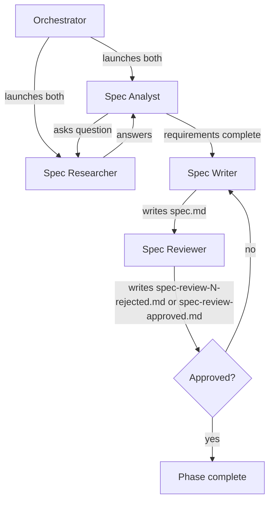

# Running the Spec Phase (Phase 1)

Advances the pipeline from phase 0 (prompt) to phase 1 by spawning a team of agents that drive iterative Q&A, synthesize a standalone spec, and review it adversarially.

Inputs:

- `<artifacts-folder>/0-prompt/prompt.md`

Outputs:

- `<artifacts-folder>/1-spec/spec-research.md`
- `<artifacts-folder>/1-spec/spec.md`
- `<artifacts-folder>/1-spec/spec-review-N-rejected.md` (one per rejected iteration, N = 1, 2, 3, …)
- `<artifacts-folder>/1-spec/spec-review-approved.md` (single, unnumbered file written on approval)

## Decisions

This phase has no per-phase decisions in this version.

## Required agents

| Agent             | Role                                                                                                                      | Persistent? |
| ----------------- | ------------------------------------------------------------------------------------------------------------------------- | ----------- |
| `spec-analyst`    | Drives the Q&A one question at a time. Writes `spec-research.md`.                                                         | Yes         |
| `spec-researcher` | Investigates the codebase, web, and runs experiments to answer questions                                                  | Yes         |
| `spec-writer`     | Writes a standalone `spec.md`.                                                                                            | No          |
| `spec-reviewer`   | Reviews the spec adversarially; writes `spec-review-N-rejected.md` on rejection or `spec-review-approved.md` on approval. | No          |

## Steps

1. Launch `spec-analyst` and `spec-researcher` as persistent agents (per the **Team spawning** convention).
2. The `spec-analyst` drives an iterative Q&A with the `spec-researcher` and writes the running record to `spec-research.md`. Wait until the `spec-analyst` signals that requirements are complete.
3. Launch a fresh `spec-writer` to write `spec.md` as a standalone document.
4. Launch a fresh `spec-reviewer`. On rejection it writes `spec-review-N-rejected.md` (N increments per rejection, starting at 1); on approval it writes `spec-review-approved.md` (no number — the singleton terminator).
5. On **rejected**, launch a fresh `spec-writer` with the rejection file's path. It revises `spec.md`. The `spec-reviewer` re-reviews.
6. On **approved**, verify the phase 1 completion predicate per `pipeline-versioning.md` ("Per-phase completion"): `spec-research.md`, `spec.md`, every `spec-review-N-rejected.md`, and `spec-review-approved.md` are committed on the pipeline branch.

