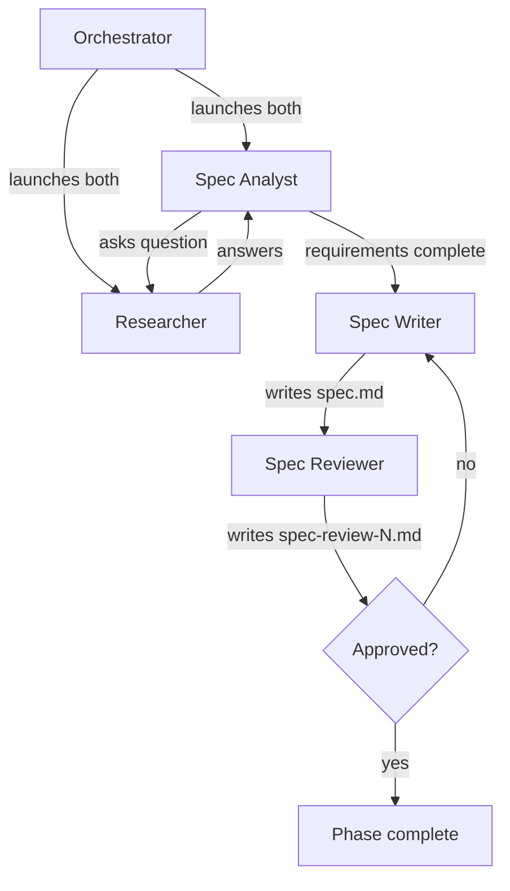

# Running the Spec Phase (Phase 1)

Advances the pipeline from phase 0 (prompt) to phase 1 by spawning a team of agents that drive iterative Q&A, synthesize a standalone spec, and review it adversarially.

Inputs:

- `<artifacts-folder>/0-prompt/prompt.md`

Outputs:

- `<artifacts-folder>/1-spec/requirements.md`
- `<artifacts-folder>/1-spec/spec.md`
- `<artifacts-folder>/1-spec/spec-review-N.md` (one per review iteration)

## Decisions

This phase has no per-phase decisions in this version.

## Required agents

| Agent           | Role                                                                         | Persistent? |
| --------------- | ---------------------------------------------------------------------------- | ----------- |
| `spec-analyst`  | Drives the Q&A one question at a time. Writes `requirements.md`.             | Yes         |
| `researcher`    | Investigates the codebase, web, and runs experiments to answer questions.    | Yes         |
| `spec-writer`   | Synthesizes `requirements.md` into a standalone `spec.md`.                   | No          |
| `spec-reviewer` | Reviews the spec adversarially; approves or rejects with `spec-review-N.md`. | No          |

## Steps

1. Launch `spec-analyst` and `researcher` as persistent agents (per the **Team spawning** convention).
2. The `spec-analyst` drives an iterative Q&A with the `researcher` and writes the running record to `requirements.md`. Wait until the `spec-analyst` signals that requirements are complete.
3. Launch a fresh `spec-writer`. It reads `prompt.md` and `requirements.md`, then writes `spec.md` as a standalone document.
4. Launch a fresh `spec-reviewer`. It writes `spec-review-N.md` (N increments per iteration) with a verdict of `approved` or `rejected`.
5. On **rejected**, launch a fresh `spec-writer` with the rejection feedback. It revises `spec.md`. The `spec-reviewer` re-reviews (N increments).
6. On **approved**, verify that `requirements.md`, `spec.md`, and every `spec-review-N.md` are committed on the pipeline branch.

