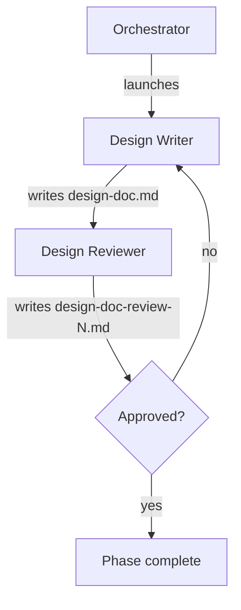

# Running the Design Doc Phase (Phase 2)

Advances the pipeline from phase 1 (spec) to phase 2 by spawning a writer that synthesizes the design doc from the spec, and a reviewer that adversarially checks it. Iterates until approved.

Inputs:

- `<artifacts-folder>/0-prompt/prompt.md`
- `<artifacts-folder>/1-spec/spec.md`

Outputs:

- `<artifacts-folder>/2-design-doc/design-doc.md`
- `<artifacts-folder>/2-design-doc/design-doc-review-N.md` (one per review iteration)

## Decisions

This phase has no per-phase decisions in this version — once launched, the team drives itself.

## Required agents

| Agent             | Role                                                                                 | Persistent? |
| ----------------- | ------------------------------------------------------------------------------------ | ----------- |
| `design-writer`   | Reads the prompt and spec, investigates the codebase, and writes `design-doc.md`.    | No          |
| `design-reviewer` | Reviews the design adversarially; approves or rejects with `design-doc-review-N.md`. | No          |

## Steps

1. Launch a fresh `design-writer`. It reads `prompt.md` and `spec.md`, explores the codebase as needed, and writes `design-doc.md`.
2. Launch a fresh `design-reviewer`. It writes `design-doc-review-N.md` (N increments per iteration) with a verdict of `approved` or `rejected`.
3. On **rejected**, launch a fresh `design-writer` with the rejection feedback. It revises `design-doc.md`. The `design-reviewer` re-reviews (N increments).
4. On **approved**, verify that `design-doc.md` and every `design-doc-review-N.md` are committed on the pipeline branch.

