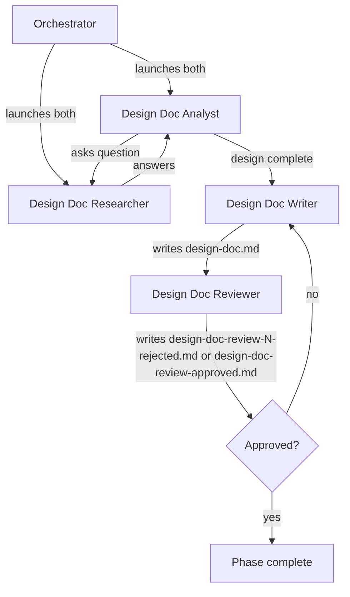

# Running the Design Doc Phase (Phase 2)

Advances the pipeline from phase 1 (spec) to phase 2 by spawning a team of agents that drive iterative design Q&A, synthesize a standalone design doc, and review it adversarially.

Inputs:

- `<artifacts-folder>/1-spec/spec.md`

Outputs:

- `<artifacts-folder>/2-design-doc/design-doc-research.md`
- `<artifacts-folder>/2-design-doc/design-doc.md`
- `<artifacts-folder>/2-design-doc/design-doc-review-N-rejected.md` (one per rejected iteration, N = 1, 2, 3, …)
- `<artifacts-folder>/2-design-doc/design-doc-review-approved.md` (single, unnumbered file written on approval)

## Decisions

This phase has no per-phase decisions in this version.

## Required agents

| Agent                   | Role                                                                                                                                               | Persistent? |
| ----------------------- | -------------------------------------------------------------------------------------------------------------------------------------------------- | ----------- |
| `design-doc-analyst`    | Drives the design Q&A one topic at a time, deciding the design on the design-doc-researcher's evidence. Writes `design-doc-research.md`.           | Yes         |
| `design-doc-researcher` | Investigates the codebase, web, and runs experiments at design altitude (mechanism, precedent implementations, architecture options, feasibility). | Yes         |
| `design-doc-writer`     | Writes a standalone `design-doc.md` from `spec.md` and `design-doc-research.md`.                                                                   | No          |
| `design-doc-reviewer`   | Reviews the design adversarially; writes `design-doc-review-N-rejected.md` on rejection or `design-doc-review-approved.md` on approval.            | No          |

## Steps

1. Launch `design-doc-analyst` and `design-doc-researcher` as persistent agents (per the **Team spawning** convention).
2. The `design-doc-analyst` drives an iterative Q&A with the `design-doc-researcher` and writes the running record to `design-doc-research.md`. Wait until the `design-doc-analyst` signals that the design is complete.
3. Launch a fresh `design-doc-writer` to synthesize `design-doc.md` as a standalone document from `spec.md` and `design-doc-research.md`.
4. Launch a fresh `design-doc-reviewer`. On rejection it writes `design-doc-review-N-rejected.md` (N increments per rejection, starting at 1); on approval it writes `design-doc-review-approved.md` (no number — the singleton terminator).
5. On **rejected**, launch a fresh `design-doc-writer` with the rejection file's path. It revises `design-doc.md`. The `design-doc-reviewer` re-reviews.
6. On **approved**, verify the phase 2 completion predicate per `pipeline-versioning.md` ("Per-phase completion"): `design-doc-research.md`, `design-doc.md`, every `design-doc-review-N-rejected.md`, and `design-doc-review-approved.md` are committed on the pipeline branch.

