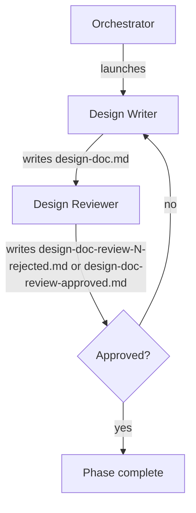

# Running the Design Doc Phase (Phase 2)

Advances the pipeline from phase 1 (spec) to phase 2 by spawning a writer that synthesizes the design doc from the spec, and a reviewer that adversarially checks it. Iterates until approved.

Inputs:

- `<artifacts-folder>/1-spec/spec.md`

Outputs:

- `<artifacts-folder>/2-design-doc/design-doc.md`
- `<artifacts-folder>/2-design-doc/design-doc-review-N-rejected.md` (one per rejected iteration, N = 1, 2, 3, …)
- `<artifacts-folder>/2-design-doc/design-doc-review-approved.md` (single, unnumbered file written on approval)

## Decisions

This phase has no per-phase decisions in this version.

## Required agents

| Agent             | Role                                                                                 | Persistent? |
| ----------------- | ------------------------------------------------------------------------------------ | ----------- |
| `design-writer`   | Writes `design-doc.md`.                                                              | No          |
| `design-reviewer` | Reviews the design adversarially; writes `design-doc-review-N-rejected.md` on rejection or `design-doc-review-approved.md` on approval. | No          |

## Steps

1. Launch a fresh `design-writer` to write `design-doc.md`.
2. Launch a fresh `design-reviewer`. On rejection it writes `design-doc-review-N-rejected.md` (N increments per rejection, starting at 1); on approval it writes `design-doc-review-approved.md` (no number — the singleton terminator).
3. On **rejected**, launch a fresh `design-writer` with the rejection file's path. It revises `design-doc.md`. The `design-reviewer` re-reviews.
4. On **approved**, verify the phase 2 completion predicate per `pipeline-versioning.md` ("Per-phase completion"): `design-doc.md`, every `design-doc-review-N-rejected.md`, and `design-doc-review-approved.md` are committed on the pipeline branch.

