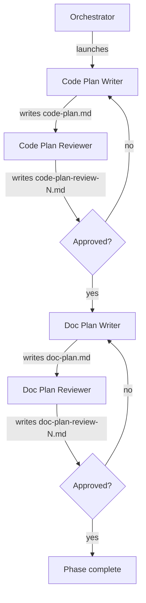

# Running the Plan Phase (Phase 3)

Advances the pipeline from phase 2 (design doc) to phase 3 by spawning two writer/reviewer pairs in sequence: first a code-plan pair that produces `code-plan.md`, then a doc-plan pair that produces `doc-plan.md`. Each pair iterates until its plan is approved.

Inputs:

- `<artifacts-folder>/0-prompt/prompt.md`
- `<artifacts-folder>/1-spec/spec.md`
- `<artifacts-folder>/2-design-doc/design-doc.md`

Outputs:

- `<artifacts-folder>/3-plan/code-plan.md`
- `<artifacts-folder>/3-plan/code-plan-review-N.md` (one per code-plan review iteration)
- `<artifacts-folder>/3-plan/doc-plan.md`
- `<artifacts-folder>/3-plan/doc-plan-review-N.md` (one per doc-plan review iteration)

## Decisions

This phase has no per-phase decisions.

## Required agents

| Agent                | Role                                                                                                       | Persistent? |
| -------------------- | ---------------------------------------------------------------------------------------------------------- | ----------- |
| `code-plan-writer`   | Reads the prompt, spec, and design doc, investigates the codebase, and writes `code-plan.md`.              | No          |
| `code-plan-reviewer` | Reviews the code plan adversarially; approves or rejects with `code-plan-review-N.md`.                     | No          |
| `doc-plan-writer`    | Reads the prompt, spec, design doc, and `code-plan.md`; writes `doc-plan.md` focused on what/where/who.    | No          |
| `doc-plan-reviewer`  | Reviews the doc plan adversarially; approves or rejects with `doc-plan-review-N.md`.                       | No          |

## Steps

1. Launch a fresh `code-plan-writer`. It reads `prompt.md`, `spec.md`, and `design-doc.md`, explores the codebase as needed, and writes `code-plan.md`.
2. Launch a fresh `code-plan-reviewer`. It writes `code-plan-review-N.md` (N increments per iteration) with a verdict of `approved` or `rejected`.
3. On **rejected**, launch a fresh `code-plan-writer` with the rejection feedback. It revises `code-plan.md`. The `code-plan-reviewer` re-reviews (N increments).
4. On **approved**, launch a fresh `doc-plan-writer`. It reads `prompt.md`, `spec.md`, `design-doc.md`, and the approved `code-plan.md`; explores the host project's existing documentation as needed; and writes `doc-plan.md`.
5. Launch a fresh `doc-plan-reviewer`. It writes `doc-plan-review-N.md` (N increments per iteration) with a verdict of `approved` or `rejected`.
6. On **rejected**, launch a fresh `doc-plan-writer` with the rejection feedback. It revises `doc-plan.md`. The `doc-plan-reviewer` re-reviews (N increments).
7. On **approved**, verify that `code-plan.md`, `doc-plan.md`, and every `code-plan-review-N.md` and `doc-plan-review-N.md` are committed on the pipeline branch.

