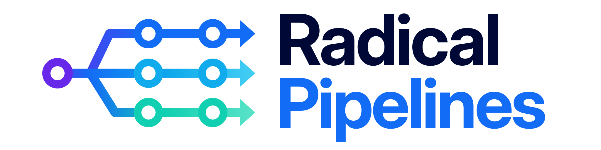

# Project Description



An agent orchestrator that runs teams of agents autonomously through a pipeline of defined phases, where each phase produces concrete, inspectable artifacts.

## The problem

Today, most of us use agents in what we'd call "assisted mode". We give them a rough idea, they start implementing, and we sit next to them correcting the course along the way. This works, but it's a workaround for two structural gaps, not a deliberate workflow.

**The first is the lack of requirements.** Without clear specs, the agent picks a direction and the human has to steer it in real time. But agents are already capable of implementing autonomously if the requirements are well-defined. Assisted mode is a workaround for missing requirements, not a limitation of the agents themselves.

**The second is the lack of determinism.** Agent output is non-deterministic. The same prompt, the same context, can produce a different result every time. So even when the human knows exactly what they want, they still assist because the agent might take a bad path this particular run.

Beyond that:

- **Assisted mode has no structure.** There's no systematic process that guarantees the right assets get produced. Whether tests, documentation, or other artifacts get generated depends entirely on the human remembering to ask for them.

- **Assisted mode is inherently local.** The context built up along the way, the decisions made, and the intermediate output only exist on the machine of the person doing the work. The final PR is the only thing the team gets to see, which makes it hard to coordinate or have multiple people work on the same task.

## The proposal

An agent orchestrator that runs teams of agents autonomously through a pipeline of defined phases. Each phase produces concrete, inspectable assets, and the pipeline can run partially or fully without human intervention.

The phases are:

- **Phase 0. Prompt.** The initial idea or request.
- **Phase 1. Spec.** Requirements, acceptance criteria and out of scope.
- **Phase 2. Design doc.** Architecture and technical decisions.
- **Phase 3. Plan.** Code plan and documentation plan.
- **Phase 4. Code.** The actual code, including unit and end-to-end tests.
- **Phase 5. Docs.** Both internal and external documentation.

The pipeline is **autonomous by default, assisted when needed.** It runs on its own, but humans can intervene at any checkpoint. For particularly complex tasks, specific phases can be run in assisted mode instead.

It is **inspectable and relaunchable.** Every phase produces artifacts your team can review. If the output at any point isn't what the team expected, anyone on the team can go back to the phase where the assumptions diverged, correct them, and relaunch the autonomous sequence from there.

It can add **determinism through redundancy.** For complex tasks, you should be able to spend more tokens on the same surface with multiple runs, validation checks, adversarial agents, and different models from different providers to converge on a more reliable output.

## What this unlocks

- **Parallel throughput.** Instead of assisting one agent at a time, a human can launch multiple autonomous pipelines and review their outputs when they're done. The constraint shifts from "how many agents can I supervise" to "how many can I review".
- **Compounding quality.** When a pipeline produces a bad result, the fix lives in a specific phase (a wrong assumption in the spec, a missing constraint in the design doc). That fix improves every future run that goes through the same pipeline, not just the one that failed.
- **Consistent assets.** Tests, documentation, and other artifacts that today depend on human diligence become a guaranteed part of every run.
- **Shareable work-in-progress.** Because every phase produces a concrete artifact, the state of a task becomes visible across the team long before a PR exists. Multiple people can review intermediate outputs and advance the same task through the pipeline, instead of only being able to react to the final result.

## Why now

- **Agents have crossed the quality threshold.** They are already capable of executing autonomously and doing a very good job, as long as the requirements are well-defined.
- **Human attention is becoming the bottleneck.** As agent adoption grows, the limiting factor in development is no longer the agents' ability to write code, it's the human time spent assisting them. Every hour spent steering an agent in real time is an hour not spent on decisions that actually need a human. And even when agents go off track, it's more optimal to inspect where they deviated, correct the assumptions, and relaunch autonomously, rather than assisting them step by step.
- **The tooling is mature enough.** Tools like Claude Code already provide the necessary primitives (skills, teams of agents, agent definitions, hooks...) to build a pipeline like this without a large investment in custom infrastructure, and for this reason, whatever is built can evolve naturally alongside them as they improve.

## Success metrics

- **Human time per task.** For a set of representative tasks, measure the total human time spent when using the pipeline vs. assisting an agent directly. The pipeline should require significantly less human time per task.
- **Pipeline completion rate.** Percentage of tasks that make it from prompt to finished implementation through all phases without requiring human intervention. A higher rate means the pipeline is genuinely autonomous, not just deferring work to the human at every checkpoint.
- **Relaunch efficiency.** When a human identifies a problem and corrects a specific phase, how many relaunch attempts does it take to reach an acceptable result? Fewer rounds means the pipeline is surfacing the right information for the human to make effective corrections.
- **Autonomy ratio.** For each task, the number of phases that ran autonomously vs. the number that required human intervention. Tracking this across tasks shows whether the pipeline is trending toward more autonomy over time, or whether certain phases consistently need a human.

# Project Usage

The repository ships a Claude Code plugin, a Pi package, and a standalone [agent skill](https://agentskills.io). All three capture the same methodology so a compatible agent can run a task through the pipeline.

## Claude Code plugin install

Claude Code installs plugins through marketplaces. This repository ships an `automattic` marketplace catalog (`.claude-plugin/marketplace.json`) that currently lists only the Radical Pipelines plugin (`.claude-plugin/plugin.json` at the repo root). Naming the marketplace `automattic` rather than `radical-pipelines` anticipates a future move to a centralized `Automattic/claude-plugins` repo without changing the install command users have memorized.

To install from the public repository:

```text
/plugin marketplace add Automattic/radical-pipelines
/plugin install radical-pipelines@automattic
```

To install from a local checkout instead — useful for verifying that a local edit to `marketplace.json` is well-formed before pushing — point `marketplace add` at the directory:

```text
/plugin marketplace add ./radical-pipelines
/plugin install radical-pipelines@automattic
```

This installs the plugin into Claude Code's cache the same way the public-repository install does.

For active local development, skip the marketplace flow entirely and load the plugin directly from a checkout with Claude Code's `--plugin-dir` flag:

```bash
claude --plugin-dir ./radical-pipelines
```

This reads the plugin from the working tree on each start (no cache copy), so edits in `skills/radical-pipelines/` are picked up without reinstalling.

The plugin currently bundles:

- the `radical-pipelines` skill, a real directory at `skills/radical-pipelines/`.
- agent profiles in the root `agents/` directory, shared with the Pi package.

Plugin skills are namespaced by the plugin name in Claude Code (not by the marketplace name). After installing, invoke the skill with `/radical-pipelines:radical-pipelines` or ask Claude Code to run Radical Pipelines.

## Pi package install

For Pi, install from the GitHub repository with Pi's `git:` source:

```bash
pi install git:github.com/Automattic/radical-pipelines
```

This routes through the single Pi manifest (`package.json` at the repo root), whose `pi` block resolves the skill from the root `skills/` directory.

The package installs:

- the `radical-pipelines` skill;
- phase agent profiles for the shipped phases and phase pairs: `spec-analyst`, `spec-researcher`, `spec-writer`, `spec-reviewer`, `spec-consolidator`, `design-doc-analyst`, `design-doc-researcher`, `design-doc-writer`, `design-doc-reviewer`, `code-plan-writer`, `code-plan-reviewer`, `doc-plan-writer`, `doc-plan-reviewer`, `code-writer`, `code-reviewer`, `doc-writer`, and `doc-reviewer` (phase 0 is the raw prompt, an input rather than an agent-produced artifact, so it has no agent profile);
- bundled `pi-teams`, `@zenobius/pi-worktrees`, and `@pi-agents/loop` Pi resources.

During package development in this repository, install dependencies once from the repository root and then install the local path:

```bash
npm install
pi install . -l
```

## Pi usage

After installing the Pi package in a repository:

1. Start with `/skill:radical-pipelines` or by asking Pi to run Radical Pipelines.
2. Ensure the phase agent profiles are discoverable by `pi-teams` — repository-local in `.pi/agents/`, or user-local/global in `~/.pi/agent/agents/`. The skill's setup flow installs them.

The orchestrator creates one `pi-teams` team per pipeline and spawns the phase agents at runtime, following the project conventions.

Validation for the local package has verified `pi install . -l`, `pi list`, and `/skill:radical-pipelines`. The local validation used print mode rather than a full manual interactive UI.

## Dependency bundling

The repository ships a single Pi manifest: the root `package.json` (`pi-package` keyword). It declares Radical Pipelines-owned resources under its `pi` block — the skill resolves from the root `skills/` directory — and references bundled third-party Pi resources through `node_modules/...` paths. Its runtime `dependencies` are `pi-teams`, `@zenobius/pi-worktrees`, `@pi-agents/loop`, and `@sinclair/typebox`. Pi core packages are wildcard peer dependencies and are not declared as runtime dependencies.

Dependency delivery is not a `bundledDependencies` mechanism. Both Pi install paths resolve this same root manifest — the `git:` install at the cloned repo root, `pi install . -l` at the local path — and Pi runs `npm install` against it after the clone, so the declared `dependencies` (and their `node_modules/...` resources referenced from the `pi` block) are present at runtime.

The skill at `skills/radical-pipelines/` and the agent profiles in `agents/` are the real sources, served directly from the repository root. There is no hidden source directory and no mirror-symlink scheme: the directories the Claude Code plugin and the Pi package read are the canonical sources themselves.

## Fallback skill install

Fallback skill-only install with the [Skills command-line tool](https://github.com/vercel-labs/skills):

```bash
npx skills add Automattic/radical-pipelines
```

The fallback only installs the skill. It does not install Pi extensions, `pi-teams`, `@zenobius/pi-worktrees`, `@pi-agents/loop`, or predefined team source files, and skill install paths can vary across CLIs, symlinks, and home-relative setups. Use the Pi package when you want package-managed Pi resources and bundled dependencies.

## Configuration

The skill is generic — each project defines its own conventions for things like the task source, existing work checks, pipeline slug format, worktree commands, branch naming, artifact folder location, and how teams of agents are spawned. Conventions live in a single merged `.rp.md` file, populated by the interactive setup flow.

If required conventions are missing when a workflow starts, Radical Pipelines stops before running the pipeline and offers an interactive setup. Setup separates shared project guidance from guidance specific to the active agentic coding tool, and writes `.rp.md` only after the owner confirms the proposed content.

Shared project conventions include task tracking, pipeline slug format, artifact folder location, and commit rules. Claude Code conventions add worktree commands (`EnterWorktree` / `ExitWorktree`), automatic branch naming, team spawning (`TeamCreate`), and the bundled `/loop` health monitor. Pi conventions add `@zenobius/pi-worktrees` setup, `pi-teams` spawning, provider/model recovery, the `@pi-agents/loop` health monitor, and Pi agent discovery rules. A given project uses one set; the active CLI determines which.

For Pi, setup also verifies that the required phase agent definitions are discoverable before the pipeline starts. It checks repository-local agents first (`.pi/agents/<agent>.md` or `.pi/agents/<agent>/SKILL.md`), then user-local/global agents (`~/.pi/agent/agents/<agent>.md` or `~/.pi/agent/agents/<agent>/SKILL.md`). If none of the required agents are available, setup stops and asks which Radical Pipelines agents the user wants to copy/paste and install, and whether to install them repository-locally or user-locally/globally.

Shared cross-agent project instructions should live in `AGENTS.md`. `CLAUDE.md` may be a thin pointer to `AGENTS.md` (for example, `@AGENTS.md`); setup preserves that pattern and should not duplicate shared `AGENTS.md` content into `CLAUDE.md`.

The orchestrator loads and verifies conventions before launching phase agents. When it spawns a phase agent or team, it passes the resolved pipeline slug, artifact folder path, exact artifact paths for that role, and the role-specific host-project conventions listed in the agent profile. Phase agents report a blocker when required context is missing instead of inferring paths from generic examples.

Each phase commits inspectable review artifacts into the task's artifact folder. In autonomous mode, reviewer agents write rejected iterations as `<artifact>-review-N-rejected.md` (N = 1, 2, 3, …) and a single `<artifact>-review-approved.md` on approval; in assisted mode, the orchestrator writes the `<artifact>-review-approved.md` file capturing the owner's explicit approval (assisted runs produce no rejection files because the owner iterates with the orchestrator before any commit). The autonomous-phase and assisted-phase references list the exact filenames per phase, and `reference/pipeline-versioning.md` documents how the orchestrator uses them to detect phase completion uniformly across both modes.

A single project keeps everything in one merged [`.rp.md`](./.rp.md): a shared section (issue tracking, pipeline slug format, artifact folder, commit format, Linear updates, push behavior) followed by a per-tool section covering only what depends on the active tool (worktrees, branch names, team spawning, health monitoring). A normal single-CLI consumer carries just the shared section plus the one tool block its CLI uses. This repository is the unusual case: as the only multi-CLI consumer of Radical Pipelines, it dogfoods both CLIs at once, so its `.rp.md` is hand-maintained to carry the shared section plus both the Claude Code and the Pi per-tool sections side-by-side.

## Changelog and versioning

The repository tracks every change in a changelog and keeps a single project version in sync across the files that declare it. It uses [Changesets](https://github.com/changesets/changesets) to record changes and drive version bumps, and a small sync step to propagate the bumped version to every version-bearing file. The configuration lives in `.changeset/config.json` and `@changesets/cli` is a development dependency of the root `package.json`.

### Adding a changeset

Per the repository's standing rule — alongside the README-update rule — every change to the repository records a changeset. A changeset is a committed `.changeset/*.md` file that describes the change and declares its bump type (`patch`, `minor`, or `major`). It travels with the pull request and accumulates on `trunk` until a maintainer cuts a version; it is not consumed when the PR merges. The matching rule lives in [`AGENTS.md`](./AGENTS.md).

Add one with the Changesets CLI from the repository root:

```bash
npx changeset
```

The command prompts for the bump type and a description, then writes a new `.changeset/*.md`. Commit that file with the change. Choose the bump type by semver: a behavior-preserving fix is a `patch`, a backward-compatible feature is a `minor`, and a breaking change is a `major`.

### The single source of truth

The `version` field in the root `package.json` is authoritative. The other version-bearing files are kept identical to it and are never edited independently:

- `.claude-plugin/plugin.json`

`.claude-plugin/marketplace.json` carries no version field — it references the plugin by `source: "./"` — so it is intentionally left out of version sync.

### Cutting a version

Cutting a version is an operator-run local action, not CI. When a maintainer decides to release, they run a single bundled run-script from the repository root:

```bash
npm run release:version
```

In one fail-fast invocation this:

1. runs `changeset version` to consume the pending `.changeset/*.md` files, write or update the root `CHANGELOG.md`, and bump the `version` in the root `package.json`;
2. runs `node scripts/sync-version.mjs` to copy the new root version into `.claude-plugin/plugin.json`.

The result is that the root `package.json` and `.claude-plugin/plugin.json` both read the same string. The maintainer then commits the result. There is no `npm publish`, no git tags, and no release CI — the root package is `"private": true` and both artifacts are consumed direct-from-git.

### How consumers get new versions

Because there is no registry publish, "release" simply means the version-bearing files and `CHANGELOG.md` are updated and committed. The repository is consumed direct-from-git — the Pi package via `pi install git:github.com/Automattic/radical-pipelines` and the Claude Code plugin via the marketplace `source: "./"` (see **Project Usage** above). Consumers therefore pick up a new version on their **next git-source or marketplace install**; no separate distribution step is involved.

## Current status and limitations

CLIs:

- Claude Code
- Pi

Entry points:

- **Work on an issue** — identify an existing issue, then create a new pipeline or act on one that already exists. The orchestrator lists the issue's existing pipelines, reconstructs their version tree, and determines each one's completed and active phase per `reference/pipeline-versioning.md`. When matches exist, the owner can **resume** an in-progress pipeline — re-attach to its branch and worktree, verify on-disk state against the per-phase completion predicate, and continue from the right phase, restarting a partially-complete phase after owner confirmation (see `reference/resume-pipeline.md`) — or **fork** a new pipeline from an existing one (see `reference/fork-pipeline.md`). The chosen pipeline then runs through a workflow.
- **Manage issues** — create or modify a well-formed issue through a short Q&A between the orchestrator and the owner. The issue records the desired _outcome_ (the always-present Goal) plus only the constraints, context, or open assumptions the owner already holds; it stays a WHAT-only prompt because requirements, design, and the task plan are produced by later phases, and the agents do their own research. The orchestrator tells the owner that under-specifying is safe and surfaces owner hypotheses as "directions to explore," not requirements. The issue body doubles as the phase-0 prompt. See `reference/manage-issues.md`.

Workflows:

- **Autonomous workflow** — runs phases unattended up to a target phase agreed with the owner at the start of the session. The owner makes all per-phase decisions up-front and the run executes without further interruptions until it reaches the target.
- **Assisted workflow** — runs one phase at a time with the owner. Phases 1, 2, and 3 are currently implemented; the orchestrator drives the work directly with the owner and commits the phase artifacts (plus a `<artifact>-review-approved.md` recording the owner's approval) once the owner explicitly approves.

The autonomous workflow launches a recurring **health monitor** for the run (5-minute interval, 10-minute no-output threshold). It watches for stalled agents, message failures, login / API-key errors, and network failures, attempts up to two bounded auto-recovery actions per issue, and escalates anything it cannot resolve to the owner with the agent name, error verbatim, last-known progress, and a suggested next step. Context-window limits are handled by each tool's built-in auto-compaction, not by the monitor. Implementation uses Claude Code's bundled `/loop` skill or the `@pi-agents/loop` Pi package. Assisted runs do not use a monitor — the owner is already in the loop. See `reference/health-monitoring.md`.

Phases (within implemented workflows):

- **Phase 0 (Prompt)** captures the task as `prompt.md`.
- **Phase 1 (Spec)** produces `spec-research.md` and `spec.md` from the prompt. In the autonomous workflow, a `spec-analyst` and a `spec-researcher` first run an iterative one-question-at-a-time Q&A loop (routed through the orchestrator) that records `spec-research.md`. The spec phase keeps its requirements to observable behavior — the `spec-analyst` directs the `spec-researcher` as deeply as each question needs, and records only what the feature must do, leaving mechanism and architecture to phase 2. Then a fresh `spec-writer` writes `spec.md` as a standalone document, and a fresh adversarial `spec-reviewer` either approves it or sends specific issues back for revision, looping until approval. A `spec-consolidator` agent profile also ships for a future multi-writer mode (N parallel `spec-writer` instances merged into one draft), but that mode is not wired into the phase yet.
- In the assisted workflow, phase 1 produces `spec-research.md` and `spec.md` through Q&A with the owner directly (no agents spawned).
- **Phase 2 (Design doc)** produces `design-doc-research.md` and `design-doc.md` from the spec. In the autonomous workflow, a `design-doc-analyst` and a `design-doc-researcher` first run an iterative one-topic-at-a-time design Q&A loop (routed through the orchestrator) that records `design-doc-research.md` — this is where the HOW is worked out at full implementation depth, the depth the spec phase deliberately left out. Then a fresh `design-doc-writer` synthesizes `design-doc.md` as a standalone document from `spec.md` and `design-doc-research.md`, and a fresh adversarial `design-doc-reviewer` either approves or sends specific issues back for revision, looping until approval.
- **Phase 3 (Plan)** ships two writer/reviewer pairs that run sequentially: first `code-plan-writer` + `code-plan-reviewer` produce `code-plan.md` (the ordered code tasks); then `doc-plan-writer` + `doc-plan-reviewer` produce `doc-plan.md` (what documentation surfaces to update, where, and for whom — without prescribing wording).
- **Phase 4 (Code)** ships `code-writer` and `code-reviewer` agent profiles. The orchestrator dispatches one fresh `code-writer` per task from `code-plan.md`, sequentially, because all writers share the pipeline branch's single working tree. Each writer implements its single assigned task with test-driven development: per-task Acceptance criteria drive unit tests in RED/GREEN/REFACTOR, then behavior verification runs through the host project's verification convention, then end-to-end tests are derived from that verification. Every gate the verification convention documents must pass before the writer commits. After every code-writer in the batch commits, a single fresh `code-reviewer` reviews the whole batch against `code-plan.md`, the spec, and the design doc. On rejection, issues are tagged per task; the orchestrator re-dispatches only the affected tasks and the reviewer runs again, until approved.
- **Phase 5 (Docs)** ships `doc-writer` and `doc-reviewer` agent profiles. The orchestrator dispatches one fresh `doc-writer` per task from `doc-plan.md`, sequentially, because all writers share the pipeline branch's single working tree. Each writer reads three sources of truth — the assigned task block (what to document, for whom), the spec and design doc (why this exists and why it is shaped this way), and the shipped code from phase 4 (what actually exists, names, signatures, paths, behavior) — and synthesizes them into documentation that matches its stated audience. Every concrete claim is verified against the shipped code; any documentation gates the host project's verification convention enumerates must pass before the writer commits (many projects enumerate none and rely on the reviewer's accuracy spot-check). After every doc-writer in the batch commits, a single fresh `doc-reviewer` reviews the whole batch against `doc-plan.md`, the spec, the design doc, and the shipped code. On rejection, issues are tagged per task; the orchestrator re-dispatches only the affected tasks and the reviewer runs again, until approved.

Pi package limitations:

- pi-teams reads predefined agents from global or project-local locations, not package-local files. Radical Pipelines agent profiles should be available either repository-locally in `.pi/agents/` or user-locally/globally in `~/.pi/agent/agents/` before they are discoverable to `pi-teams`.
- Local validation on Node v20.14.0 produced npm `EBADENGINE` warnings from transitive dependencies and two moderate `npm audit` findings.
- Open PRs may change nearby guidance later: PR #6 may improve pi-teams examples, PR #10 may change convention setup, and PR #12 may add orchestration safeguards. This package does not depend on those PRs being merged.
