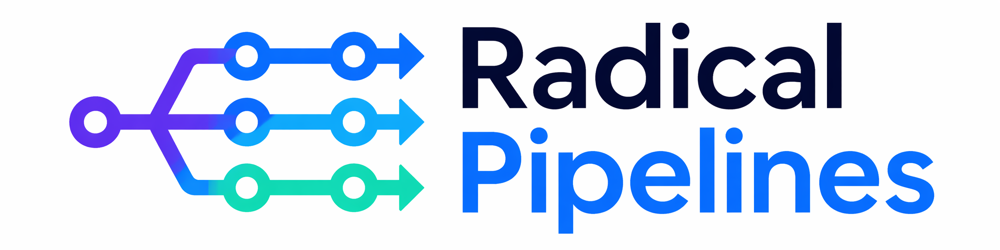

# Project Description



An agent orchestrator that runs teams of agents autonomously through a pipeline of defined phases, where each phase produces concrete, inspectable artifacts.

## The problem

Today, most of us use agents in what we'd call "assisted mode". We give them a rough idea, they start implementing, and we sit next to them correcting the course along the way. This works, but it's a workaround for two structural gaps, not a deliberate workflow.

**The first is the lack of requirements.** Without clear specs, the agent picks a direction and the human has to steer it in real time. But agents are already capable of implementing autonomously if the requirements are well-defined. Assisted mode is a workaround for missing requirements, not a limitation of the agents themselves.

**The second is the lack of determinism.** Agent output is non-deterministic. The same prompt, the same context, can produce a different result every time. So even when the human knows exactly what they want, they still assist because the agent might take a bad path this particular run.

Beyond that:

- **Assisted mode has no structure.** There's no systematic process that guarantees the right assets get produced. Whether tests, documentation, or other artifacts get generated depends entirely on the human remembering to ask for them.

- **Assisted mode is inherently local.** The context built up along the way, the decisions made, and the intermediate output only exist on the machine of the person doing the work. The final PR is the only thing the team gets to see, which makes it hard to coordinate or have multiple people work on the same task.

## The proposal

An agent orchestrator that runs teams of agents autonomously through a pipeline of defined phases. Each phase produces concrete, inspectable assets, and the pipeline can run partially or fully without human intervention.

The phases are:

- **Phase 0. Prompt.** The initial idea or request.
- **Phase 1. Spec.** Requirements, acceptance criteria and out of scope.
- **Phase 2. Design doc.** Architecture and technical decisions.
- **Phase 3. Plan.** Code plan and documentation plan.
- **Phase 4. Code.** The actual code, including unit and end-to-end tests.
- **Phase 5. Docs.** Both internal and external documentation.

The pipeline is **autonomous by default, assisted when needed.** It runs on its own, but humans can intervene at any checkpoint. For particularly complex tasks, specific phases can be run in assisted mode instead.

It is **inspectable and relaunchable.** Every phase produces artifacts your team can review. If the output at any point isn't what the team expected, anyone on the team can go back to the phase where the assumptions diverged, correct them, and relaunch the autonomous sequence from there.

It can add **determinism through redundancy.** For complex tasks, you should be able to spend more tokens on the same surface with multiple runs, validation checks, adversarial agents, and different models from different providers to converge on a more reliable output.

## What this unlocks

- **Parallel throughput.** Instead of assisting one agent at a time, a human can launch multiple autonomous pipelines and review their outputs when they're done. The constraint shifts from "how many agents can I supervise" to "how many can I review".
- **Compounding quality.** When a pipeline produces a bad result, the fix lives in a specific phase (a wrong assumption in the spec, a missing constraint in the design doc). That fix improves every future run that goes through the same pipeline, not just the one that failed.
- **Consistent assets.** Tests, documentation, and other artifacts that today depend on human diligence become a guaranteed part of every run.
- **Shareable work-in-progress.** Because every phase produces a concrete artifact, the state of a task becomes visible across the team long before a PR exists. Multiple people can review intermediate outputs and advance the same task through the pipeline, instead of only being able to react to the final result.

## Why now

- **Agents have crossed the quality threshold.** They are already capable of executing autonomously and doing a very good job, as long as the requirements are well-defined.
- **Human attention is becoming the bottleneck.** As agent adoption grows, the limiting factor in development is no longer the agents' ability to write code, it's the human time spent assisting them. Every hour spent steering an agent in real time is an hour not spent on decisions that actually need a human. And even when agents go off track, it's more optimal to inspect where they deviated, correct the assumptions, and relaunch autonomously, rather than assisting them step by step.
- **The tooling is mature enough.** Tools like Claude Code already provide the necessary primitives (skills, teams of agents, agent definitions, hooks...) to build a pipeline like this without a large investment in custom infrastructure, and for this reason, whatever is built can evolve naturally alongside them as they improve.

## Success metrics

- **Human time per task.** For a set of representative tasks, measure the total human time spent when using the pipeline vs. assisting an agent directly. The pipeline should require significantly less human time per task.
- **Pipeline completion rate.** Percentage of tasks that make it from prompt to finished implementation through all phases without requiring human intervention. A higher rate means the pipeline is genuinely autonomous, not just deferring work to the human at every checkpoint.
- **Relaunch efficiency.** When a human identifies a problem and corrects a specific phase, how many relaunch attempts does it take to reach an acceptable result? Fewer rounds means the pipeline is surfacing the right information for the human to make effective corrections.
- **Autonomy ratio.** For each task, the number of phases that ran autonomously vs. the number that required human intervention. Tracking this across tasks shows whether the pipeline is trending toward more autonomy over time, or whether certain phases consistently need a human.

# Project Usage

The repository ships a Claude Code plugin, a Pi package, and a standalone [agent skill](https://agentskills.io). All three capture the same methodology so a compatible agent can run a task through the pipeline.

## Claude Code plugin install

Claude Code installs plugins through marketplaces. This repository ships an `automattic` marketplace catalog (`.claude-plugin/marketplace.json`) that currently lists only the Radical Pipelines plugin (`.claude-plugin/plugin.json` at the repo root). Naming the marketplace `automattic` rather than `radical-pipelines` anticipates a future move to a centralized `Automattic/claude-plugins` repo without changing the install command users have memorized.

To install from the public repository:

```text
/plugin marketplace add Automattic/radical-pipelines
/plugin install radical-pipelines@automattic
```

To install from a local checkout instead — useful for verifying that a local edit to `marketplace.json` is well-formed before pushing — point `marketplace add` at the directory:

```text
/plugin marketplace add ./radical-pipelines
/plugin install radical-pipelines@automattic
```

This installs the plugin into Claude Code's cache the same way the public-repository install does.

For active local development, skip the marketplace flow entirely and load the plugin directly from a checkout with Claude Code's `--plugin-dir` flag:

```bash
claude --plugin-dir ./radical-pipelines
```

This reads the plugin from the working tree on each start (no cache copy), so edits in `.agents/skills/radical-pipelines/` are picked up through the `skills/radical-pipelines/` symlink without reinstalling.

The plugin currently bundles:

- the `radical-pipelines` skill (exposed under `skills/radical-pipelines/` as a symlink to `.agents/skills/radical-pipelines/` so the source of truth stays in `.agents/`).
- agent profiles under `agents/` (symlink to `.agents/agents/`), shared with the Pi package.

Plugin skills are namespaced by the plugin name in Claude Code (not by the marketplace name). After installing, invoke the skill with `/radical-pipelines:radical-pipelines` or ask Claude Code to run Radical Pipelines.

## Pi package install

For Pi, install from the GitHub repository with Pi's `git:` source:

```bash
pi install git:github.com/Automattic/radical-pipelines
```

This routes through the root-level Pi manifest (`package.json` at the repo root), which reads the same `.pi-extension/` content as local development installs.

The package installs:

- the `radical-pipelines` skill;
- phase agent profiles for the shipped phases and phase pairs: `prompt-writer`, `spec-analyst`, `researcher`, `spec-writer`, `spec-reviewer`, `spec-consolidator`, `design-writer`, `design-reviewer`, `code-plan-writer`, `code-plan-reviewer`, `doc-plan-writer`, `doc-plan-reviewer`, `code-writer`, `code-reviewer`, `doc-writer`, and `doc-reviewer`;
- the `radical-pipelines-spec`, `radical-pipelines-design`, `radical-pipelines-plan`, and `radical-pipelines-code` pi-teams templates as package-local source definitions. These team templates are intended to be registered globally for `pi-teams`, not copied into every target repository. The full `radical-pipelines` team will ship alongside later workflow orchestration;
- bundled `pi-teams`, `@zenobius/pi-worktrees`, and `@pi-agents/loop` Pi resources.

During package development in this repository, install dependencies first and then install the local path:

```bash
cd .pi-extension
npm install
cd ..
pi install ./.pi-extension -l
```

## Pi usage

After installing the Pi package in a repository:

1. Start with `/skill:radical-pipelines` or by asking Pi to run Radical Pipelines.
2. Ensure the packaged team templates have been registered in the global `~/.pi/teams.yaml` file used by `pi-teams`.
3. Use pi-teams predefined team creation with the `radical-pipelines-spec`, `radical-pipelines-design`, `radical-pipelines-plan`, or `radical-pipelines-code` template, depending on the phase you are running.

Validation for the local package has verified `pi install ./.pi-extension -l`, `pi list`, and `/skill:radical-pipelines`. Predefined team discovery requires global `pi-teams` registration because `pi-teams` does not currently read package-local team files directly. The local validation used print mode rather than a full manual interactive UI.

## Dependency bundling

`.pi-extension/package.json` is a Pi package (`pi-package` keyword) used by local development installs. It declares Radical Pipelines-owned resources under the `pi` manifest and references bundled third-party Pi resources through package-local `node_modules/...` paths. Runtime dependencies include `pi-teams`, `@zenobius/pi-worktrees`, `@pi-agents/loop`, and `@sinclair/typebox`; these are also bundled. Pi core packages are wildcard peer dependencies and are not bundled.

The repository root also ships a Pi manifest (`package.json`) so `pi install git:github.com/Automattic/radical-pipelines` resolves at the cloned repo root. The root manifest declares the same bundled dependencies directly and points its `pi` manifest paths at `.pi-extension/` files, so both layers share a single source of truth.

The skill at `.agents/skills/radical-pipelines/` and the agent profiles at `.agents/agents/` are the canonical sources. Both the Pi package (via `.pi-extension/skills` and `.pi-extension/agents` symlinks) and the Claude Code plugin (via root `skills/` and `agents/` symlinks) point at them.

## Fallback skill install

Fallback skill-only install with the [Skills command-line tool](https://github.com/vercel-labs/skills):

```bash
npx skills add Automattic/radical-pipelines
```

The fallback only installs the skill. It does not install Pi extensions, `pi-teams`, `@zenobius/pi-worktrees`, `@pi-agents/loop`, or predefined team source files, and skill install paths can vary across CLIs, symlinks, and home-relative setups. Use the Pi package when you want package-managed Pi resources and bundled dependencies.

## Configuration

The skill is generic — each project defines its own conventions for things like the task source, existing work checks, pipeline slug format, worktree commands, branch naming, artifact folder location, and how teams of agents are spawned. These conventions can live in any of these places (checked in order):

1. Shared project instructions in the project-root `AGENTS.md`.
2. A dedicated conventions skill (e.g., `rp-conventions`).
3. A Radical Pipelines `rp.md` file in the active CLI's config folder — `.pi/rp.md` for Pi or `.claude/rp.md` for Claude Code.

If required conventions are missing when a workflow starts, Radical Pipelines stops before running the pipeline and offers an interactive setup flow. Setup asks for the missing convention details, separates shared project guidance from CLI-specific guidance, and can write reusable Markdown for the active CLI after confirmation. Pi setup writes only Pi conventions to `.pi/rp.md`; Claude Code setup writes only Claude Code conventions to `.claude/rp.md`.

Shared project conventions include task tracking, pipeline slug format, artifact folder location, and commit rules. Claude Code conventions include Claude Code worktree commands, branch creation, team spawning, health-monitoring loop commands (bundled `/loop`), and Claude Code prerequisites. Pi conventions include Pi packages and plugins, Pi worktree commands, branch creation, pi-teams spawning, provider/model recovery, health-monitoring loop commands (`@pi-agents/loop`), and Pi agent setup. Do not mix Claude Code conventions into `.pi/rp.md`, and do not mix Pi conventions into `.claude/rp.md`.

For Pi, setup also verifies that the required phase agent definitions are discoverable before the pipeline starts. It checks repository-local agents first (`.pi/agents/<agent>.md` or `.pi/agents/<agent>/SKILL.md`), then user-local/global agents (`~/.pi/agent/agents/<agent>.md` or `~/.pi/agent/agents/<agent>/SKILL.md`). If none of the required agents are available, setup stops and asks which Radical Pipelines agents the user wants to copy/paste and install, and whether to install them repository-locally or user-locally/globally.

Shared cross-agent project instructions should live in `AGENTS.md`. `CLAUDE.md` may be a thin pointer to `AGENTS.md` (for example, `@AGENTS.md`); setup preserves that pattern and should not duplicate shared `AGENTS.md` content into `CLAUDE.md`.

The orchestrator loads and verifies conventions before launching phase agents. When it spawns a phase agent or team, it passes the resolved pipeline slug, artifact folder path, exact artifact paths for that role, and the role-specific host-project conventions listed in the agent profile. Phase agents report a blocker when required context is missing instead of inferring paths from generic examples.

Reviewer agents write inspectable review artifacts into the task's artifact folder on every review iteration. Current artifact names are `spec-review-N.md`, `design-doc-review-N.md`, `code-plan-review-N.md`, `doc-plan-review-N.md`, `code-review-N.md`, and `docs-review-N.md`, where N starts at 1 and increments for each writer/reviewer round.

See this repository's own [`.claude/rp.md`](./.claude/rp.md) and [`.pi/rp.md`](./.pi/rp.md) for examples of separate CLI convention files. Pi projects should define Pi-only worktree setup (for example `/worktree settings worktreeRoot .pi/worktrees`), pi-teams spawning conventions, and Pi agent setup expectations in `.pi/rp.md`; Claude Code projects should define Claude Code-only worktree and team-spawning conventions in `.claude/rp.md`.

## Current status and limitations

CLIs:

- Claude Code
- Pi

Workflows:

- **Autonomous workflow** — runs phases unattended up to a target phase agreed with the owner at the start of the session. The owner makes all per-phase decisions up-front and the run executes without further interruptions until it reaches the target.
- **Assisted workflow** — runs one phase at a time with the owner. Phase 1 is currently implemented as an owner-driven Q&A flow that records `requirements.md`, synthesizes `spec.md`, and waits for explicit owner approval before committing.

The autonomous workflow launches a recurring **health monitor** for the run (5-minute interval, 10-minute no-output threshold). It watches for stalled agents, message failures, login / API-key errors, token-limit warnings, session-time-limit, and network failures, attempts up to two bounded auto-recovery actions per issue, and escalates anything it cannot resolve to the owner with the agent name, error verbatim, last-known progress, and a suggested next step. Implementation uses Claude Code's bundled `/loop` skill or the `@pi-agents/loop` Pi package. Assisted runs do not use a monitor — the owner is already in the loop. See `reference/health-monitoring.md`.

Phases (within implemented workflows):

- **Phase 0 (Prompt)** captures the task as `prompt.md`.
- **Phase 1 (Spec)** produces `requirements.md` and `spec.md` from the prompt. In the autonomous workflow, a `spec-analyst` and a `researcher` first run an iterative one-question-at-a-time Q&A loop (routed through the orchestrator) that records `requirements.md`. Then one of two spec generation modes runs, chosen at planning time:
  - `single` — one `spec-writer` + one adversarial `spec-reviewer` in a revision loop. The reviewer writes `spec-review-N.md` artifacts.
  - `multi` — N parallel `spec-writer` instances followed by a `spec-consolidator` that merges the drafts.
- In the assisted workflow, phase 1 produces `requirements.md` and `spec.md` through Q&A with the owner directly (no agents spawned).
- **Phase 2 (Design doc)** produces `design-doc.md` from the spec. In the autonomous workflow, a fresh `design-writer` reads `prompt.md` and `spec.md`, investigates the codebase, and writes `design-doc.md`; then a fresh adversarial `design-reviewer` writes `design-doc-review-N.md` and either approves or sends specific issues back for revision. The loop continues until approval. The `radical-pipelines-design` team template wires these two agents together for project-convention-driven use.
- **Phase 3 (Plan)** ships two writer/reviewer pairs that run sequentially: first `code-plan-writer` + `code-plan-reviewer` produce `code-plan.md` (the ordered code tasks); then `doc-plan-writer` + `doc-plan-reviewer` produce `doc-plan.md` (what documentation surfaces to update, where, and for whom — without prescribing wording). The reviewers write `code-plan-review-N.md` and `doc-plan-review-N.md` artifacts. The `radical-pipelines-plan` team template bundles all four agents for project-convention-driven use.
- **Phase 4 (Code)** ships `code-writer` and `code-reviewer` agent profiles plus the `radical-pipelines-code` team template. The orchestrator dispatches one fresh `code-writer` per task from `code-plan.md`, sequentially, because all writers share the pipeline branch's single working tree. Each writer implements its single assigned task with test-driven development: per-task Acceptance criteria drive unit tests in RED/GREEN/REFACTOR, then behavior verification runs through the host project's verification convention, then end-to-end tests are derived from that verification. Every gate the verification convention documents must pass before the writer commits. After every code-writer in the batch commits, a single fresh `code-reviewer` reviews the whole batch against `code-plan.md`, the spec, and the design doc, and writes `code-review-N.md`. On rejection, issues are tagged per task; the orchestrator re-dispatches only the affected tasks and the reviewer runs again, until approved.
- **Phase 5 (Docs)** ships a `doc-writer` paired with an adversarial `doc-reviewer` in a revision loop. The doc-writer reads its assigned task from `doc-plan.md` and the actual code that landed in phase 4 (so it picks up any drift between the plan and the implementation), then updates the README, package docs, examples, and project conventions. The reviewer writes `docs-review-N.md` artifacts. Full pipeline orchestration into phase 5 will arrive when the later phase workflow docs are implemented.

Pi package limitations:

- pi-teams currently reads predefined agents/templates from global or project-local locations, not package-local files. Radical Pipelines team definitions should be registered globally in `~/.pi/teams.yaml`; agent profiles should be available either repository-locally in `.pi/agents/` or user-locally/globally in `~/.pi/agent/agents/`, before predefined Radical Pipelines teams are visible.
- Local validation on Node v20.14.0 produced npm `EBADENGINE` warnings from transitive dependencies and two moderate `npm audit` findings.
- Open PRs may change nearby guidance later: PR #6 may improve pi-teams examples, PR #10 may change convention setup, and PR #12 may add orchestration safeguards. This package does not depend on those PRs being merged.
