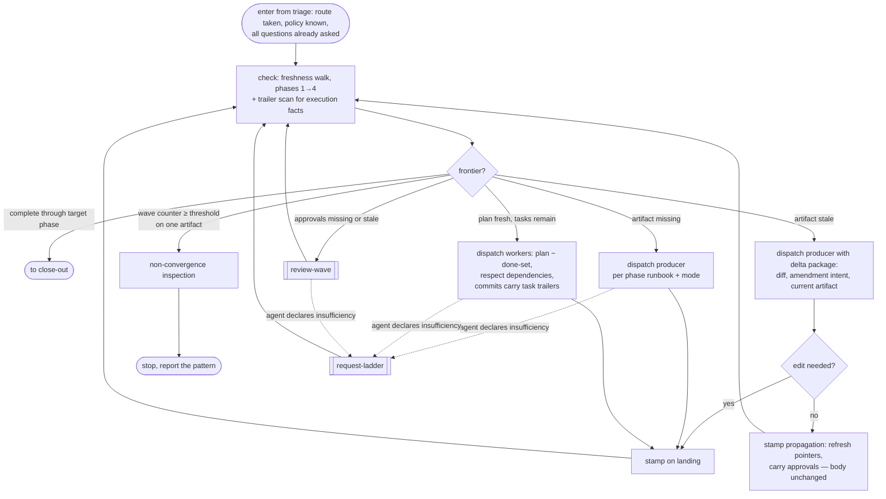

# convergence-loop

```mermaid
flowchart TD
    A([enter from triage: route taken, policy known,<br/>all questions already asked]) --> CK
    CK[check: freshness walk, phases 1→4<br/>+ trailer scan for execution facts] --> F{frontier?}

    F -->|complete through target phase| DONE([to close-out])
    F -->|artifact missing| PM[dispatch producer<br/>per phase runbook + mode]
    F -->|artifact stale| PS[dispatch producer with delta package:<br/>diff, amendment intent, current artifact]
    F -->|approvals missing or stale| RW[[review-wave]]
    F -->|plan fresh, tasks remain| W[dispatch workers: plan − done-set,<br/>respect dependencies,<br/>commits carry task trailers]
    F -->|wave counter ≥ threshold<br/>on one artifact| NC[non-convergence inspection]

    PS --> NE{edit needed?}
    NE -->|yes| LAND[stamp on landing]
    NE -->|no| SP[stamp propagation: refresh pointers,<br/>carry approvals — body unchanged]
    SP --> CK
    PM --> LAND
    W --> LAND
    RW --> CK
    LAND --> CK
    NC --> STOP([stop, report the pattern])

    PM -.agent declares insufficiency.-> RL[[request-ladder]]
    W -.agent declares insufficiency.-> RL
    RW -.agent declares insufficiency.-> RL
    RL --> CK
```
