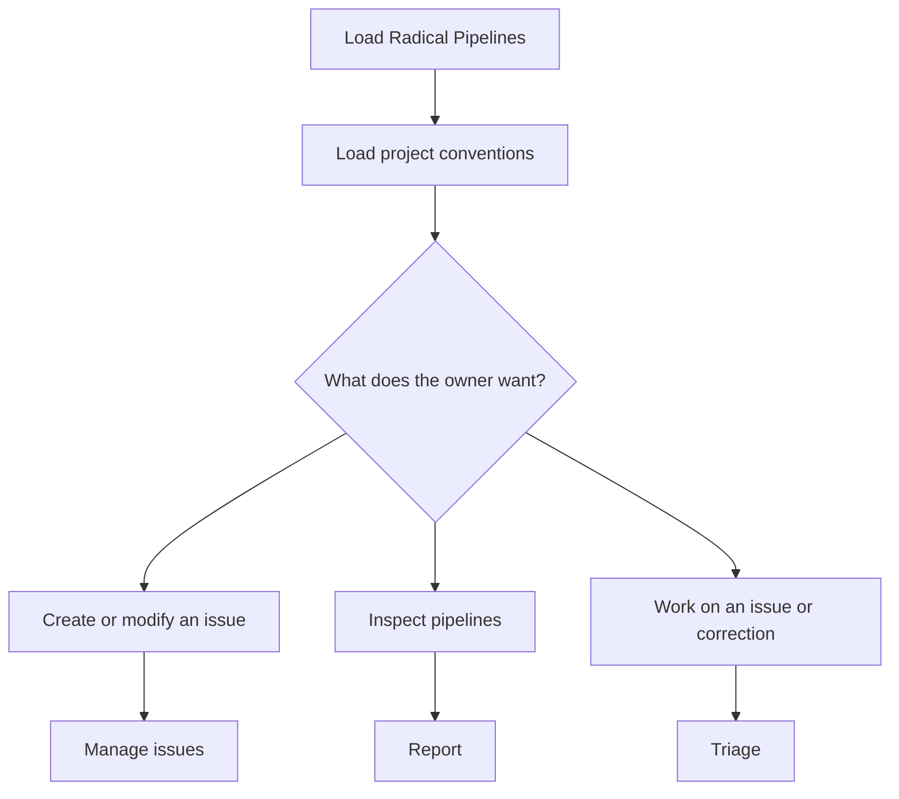

# Entry

This chart mirrors the entry-point table in [`SKILL.md`](../../skills/radical-pipelines/SKILL.md): every request loads project conventions before routing by the owner's goal.

```mermaid
flowchart TD
    A["Load Radical Pipelines"] --> B["Load project conventions"]
    B --> C{"What does the owner want?"}
    C --> D["Create or modify an issue"]
    C --> E["Inspect pipelines"]
    C --> F["Work on an issue or correction"]
    D --> G["Manage issues"]
    E --> H["Report"]
    F --> I["Triage"]
```
