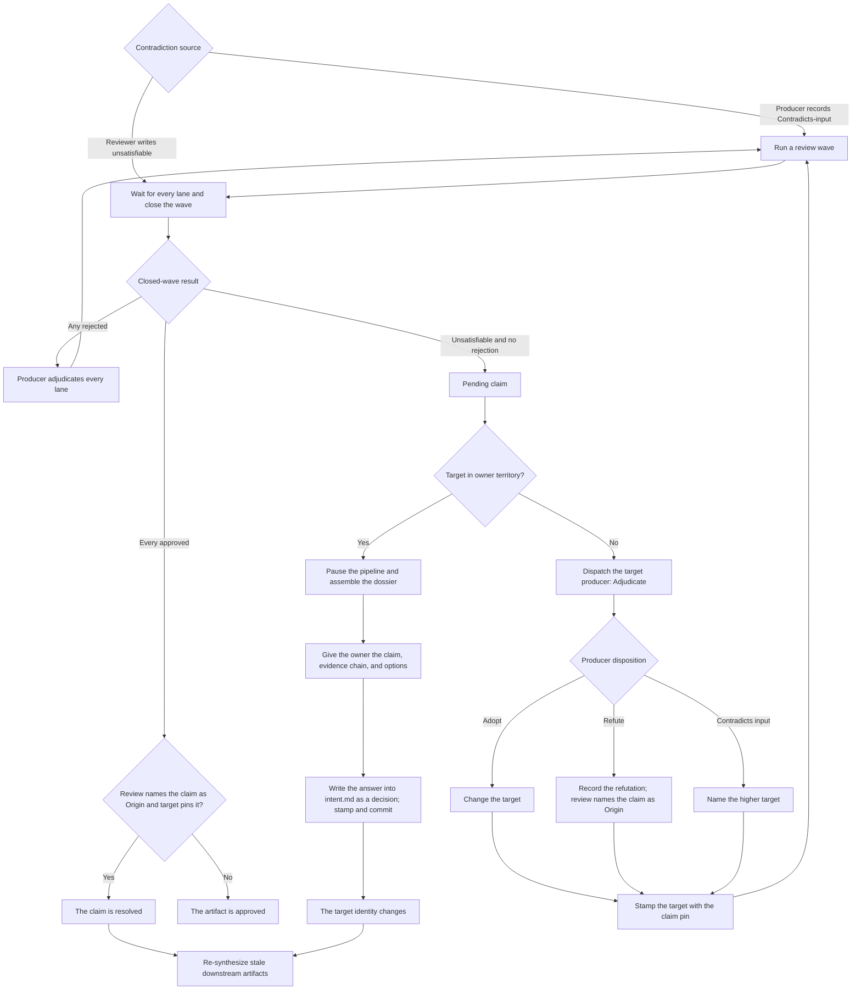

# Contradiction escalation

This chart mirrors the claim and owner-escalation path in [`reference/run/loop.md`](../../skills/radical-pipelines/reference/run/loop.md): a producer's evidence must survive review before a contradiction can move to its target or reach the owner.

