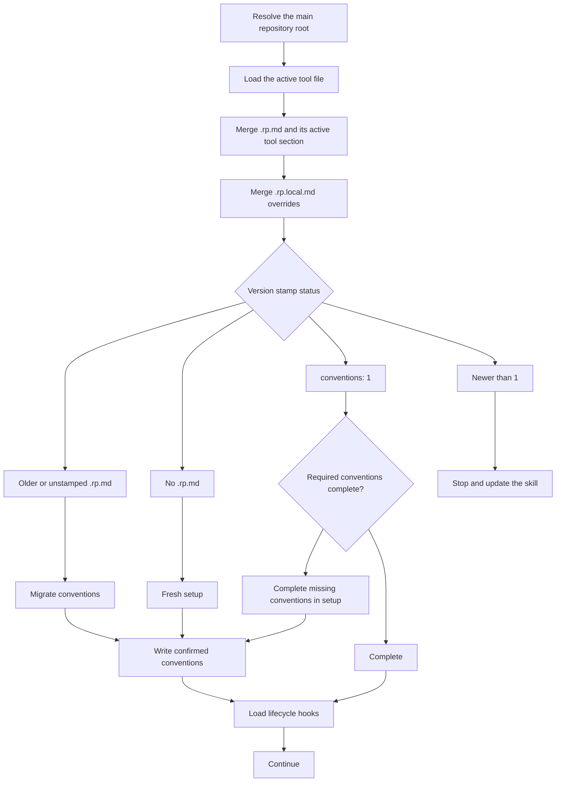

# Load conventions

This chart mirrors [`reference/conventions/load.md`](../../skills/radical-pipelines/reference/conventions/load.md), including its migration and setup handoffs before lifecycle hooks are loaded.

