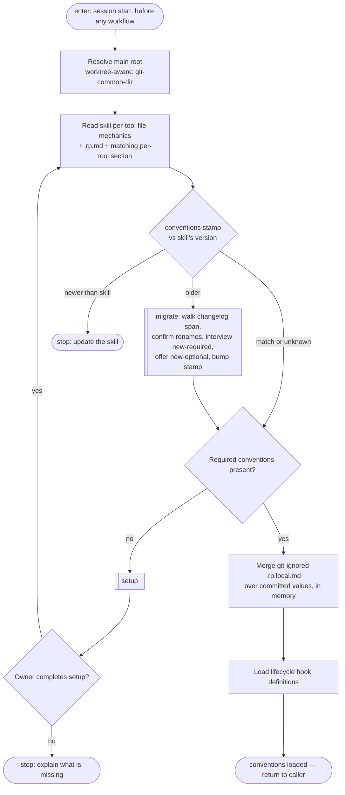

# load-conventions

```mermaid
flowchart TD
    A([enter: session start, before any workflow]) --> B[Resolve main root<br/>worktree-aware: git-common-dir]
    B --> C[Read skill per-tool file mechanics<br/>+ .rp.md + matching per-tool section]
    C --> V{conventions stamp<br/>vs skill's version}
    V -->|match or unknown| D{Required conventions present?}
    V -->|older| MG[[migrate: walk changelog span,<br/>confirm renames, interview new-required,<br/>offer new-optional, bump stamp]]
    MG --> D
    V -->|newer than skill| G2([stop: update the skill])
    D -->|no| E[[setup]]
    E --> F2{Owner completes setup?}
    F2 -->|no| G([stop: explain what is missing])
    F2 -->|yes| C
    D -->|yes| H[Merge git-ignored .rp.local.md<br/>over committed values, in memory]
    H --> I[Load lifecycle hook definitions]
    I --> J([conventions loaded — return to caller])
```
