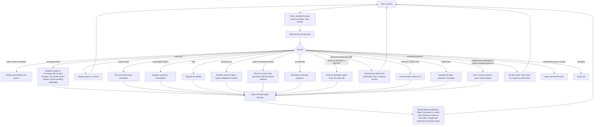

# Autonomous loop

This chart mirrors [`reference/run/loop.md`](../../skills/radical-pipelines/reference/run/loop.md): each check selects the first frontier item, dispatches its resolver, stamps landed work, and repeats until close-out or owner escalation.

