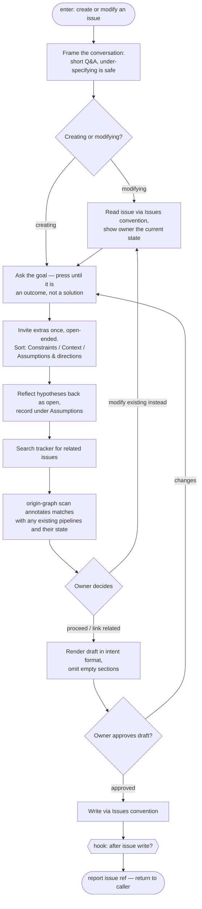

# manage-issues

```mermaid
flowchart TD
    A([enter: create or modify an issue]) --> D[Frame the conversation:<br/>short Q&A, under-specifying is safe]
    D --> E{Creating or modifying?}
    E -->|modifying| F[Read issue via Issues convention,<br/>show owner the current state]
    E -->|creating| G
    F --> G[Ask the goal — press until it is<br/>an outcome, not a solution]
    G --> H[Invite extras once, open-ended.<br/>Sort: Constraints / Context /<br/>Assumptions & directions]
    H --> I[Reflect hypotheses back as open,<br/>record under Assumptions]
    I --> J[Search tracker for related issues]
    J --> J2[origin-graph scan annotates matches<br/>with any existing pipelines and their state]
    J2 --> K{Owner decides}
    K -->|modify existing instead| F
    K -->|proceed / link related| L[Render draft in intent format,<br/>omit empty sections]
    L --> M{Owner approves draft?}
    M -->|changes| G
    M -->|approved| N[Write via Issues convention]
    N --> O{{hook: after issue write?}}
    O --> P([report issue ref — return to caller])
```
