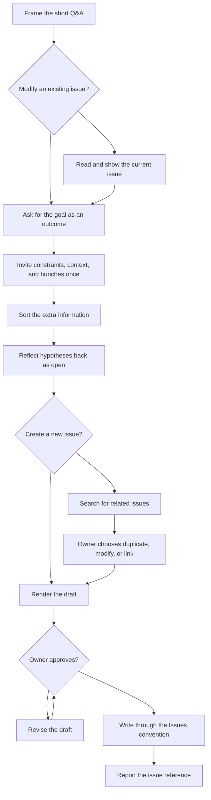

# Manage issues

This chart mirrors [`reference/entries/manage-issues.md`](../../skills/radical-pipelines/reference/entries/manage-issues.md): the orchestrator conducts a short Q&A, obtains approval, and writes through the Issues convention.

