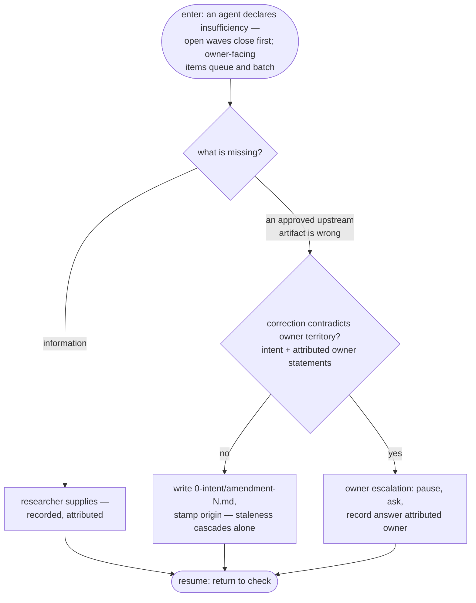

# request-ladder

```mermaid
flowchart TD
    A([enter: an agent declares insufficiency —<br/>open waves close first; owner-facing<br/>items queue and batch]) --> KIND{what is missing?}

    KIND -->|information| RES[researcher supplies —<br/>recorded, attributed]
    KIND -->|an approved upstream<br/>artifact is wrong| GATE{correction contradicts owner territory?<br/>intent + attributed owner statements}

    GATE -->|no| AMD[write 0-intent/amendment-N.md,<br/>stamp origin — staleness cascades alone]
    GATE -->|yes| ESC[owner escalation: pause, ask,<br/>record answer attributed owner]

    RES --> BACK([resume: return to check])
    AMD --> BACK
    ESC --> BACK
```
