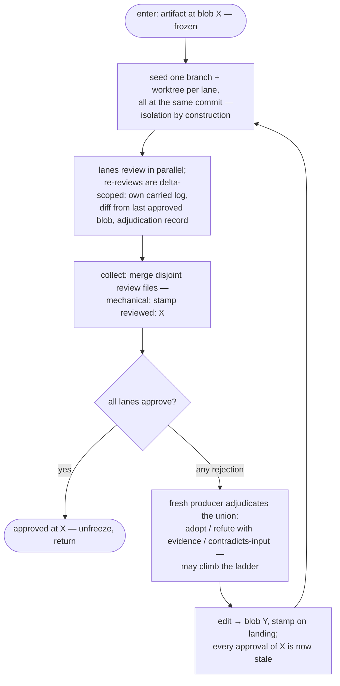

# review-wave

```mermaid
flowchart TD
    A([enter: artifact at blob X — frozen]) --> S[seed one branch + worktree per lane,<br/>all at the same commit —<br/>isolation by construction]
    S --> R[lanes review in parallel;<br/>re-reviews are delta-scoped: own carried log,<br/>diff from last approved blob, adjudication record]
    R --> C[collect: merge disjoint review files —<br/>mechanical; stamp reviewed: X]
    C --> V{all lanes approve?}
    V -->|yes| OK([approved at X — unfreeze, return])
    V -->|any rejection| ADJ[fresh producer adjudicates the union:<br/>adopt / refute with evidence / contradicts-input —<br/>may climb the ladder]
    ADJ --> E[edit → blob Y, stamp on landing;<br/>every approval of X is now stale]
    E --> S
```
