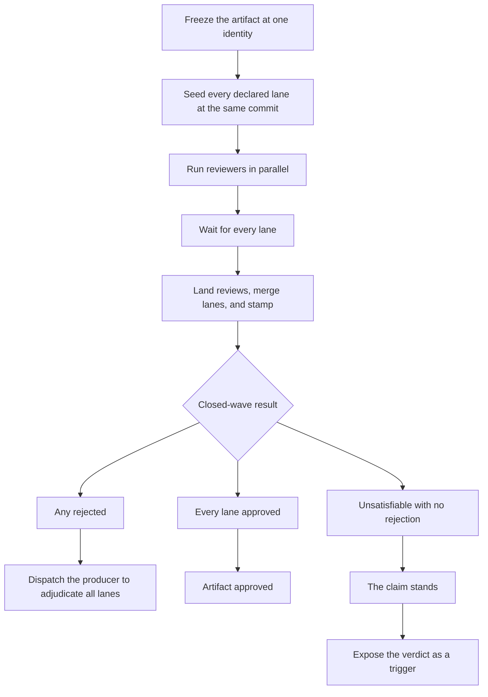

# Review wave

This chart mirrors the review-wave procedure in [`reference/run/loop.md`](../../skills/radical-pipelines/reference/run/loop.md): all lanes review one frozen identity atomically before their verdicts route the next step.

