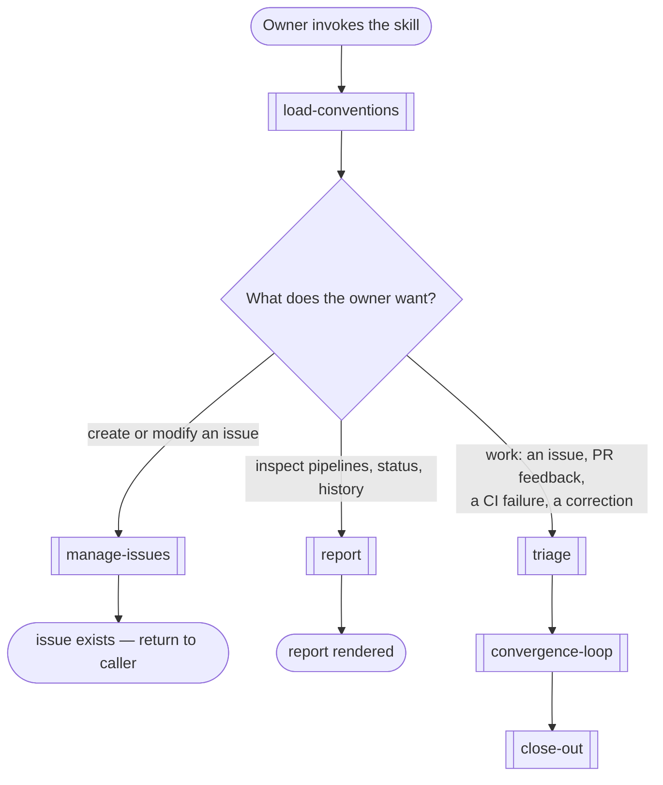

# Skill entry

```mermaid
flowchart TD
    A([Owner invokes the skill]) --> B[[load-conventions]]
    B --> C{What does the owner want?}

    C -->|create or modify an issue| MI[[manage-issues]]
    C -->|inspect pipelines, status, history| RS[[report]]
    C -->|work: an issue, PR feedback,<br/>a CI failure, a correction| TR[[triage]]

    MI --> MIx([issue exists — return to caller])
    RS --> RSx([report rendered])
    TR --> CL[[convergence-loop]]
    CL --> CO[[close-out]]
```
