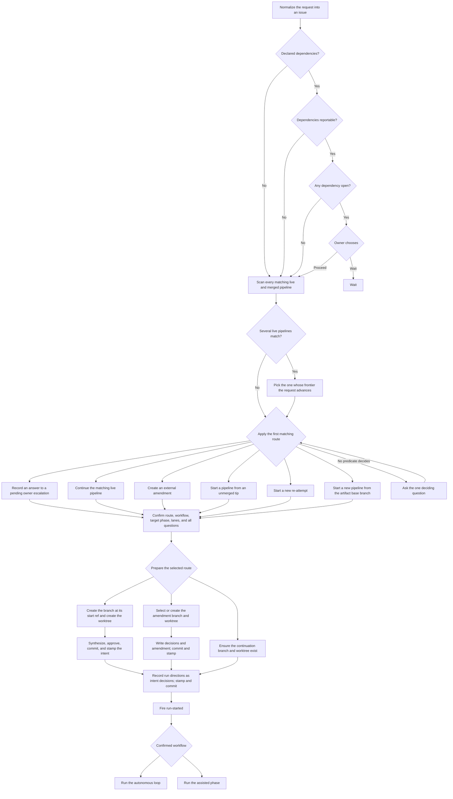

# Triage

This chart mirrors [`reference/entries/triage.md`](../../skills/radical-pipelines/reference/entries/triage.md), from issue normalization and tree scanning through first-match routing, preparation, and run dispatch.

