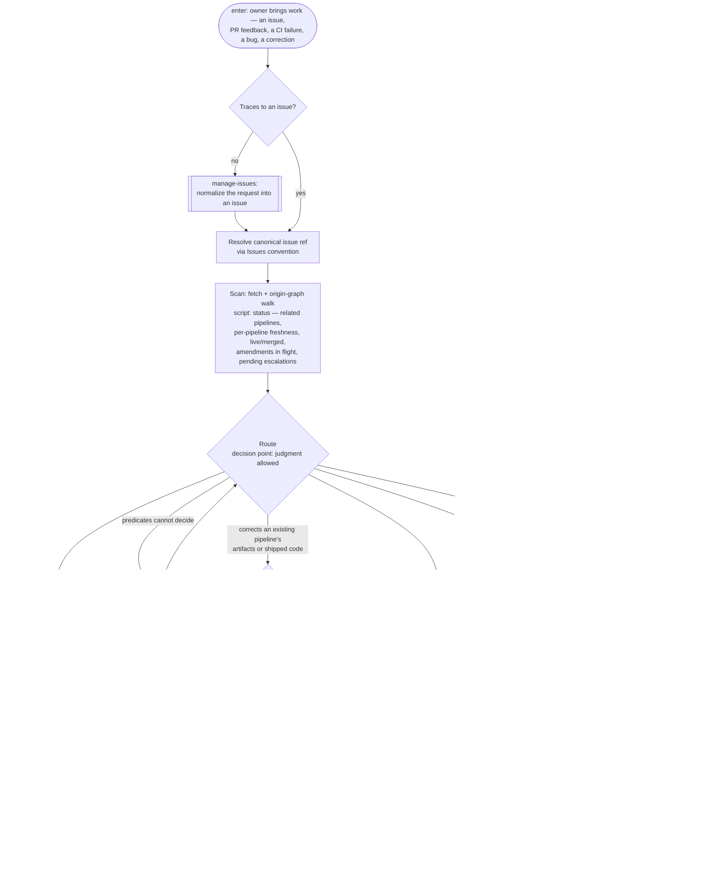

# triage

```mermaid
flowchart TD
    A([enter: owner brings work — an issue,<br/>PR feedback, a CI failure, a bug, a correction]) --> B{Traces to an issue?}
    B -->|no| MI[[manage-issues:<br/>normalize the request into an issue]]
    MI --> C
    B -->|yes| C[Resolve canonical issue ref<br/>via Issues convention]
    C --> D[Scan: fetch + origin-graph walk<br/>script: status — related pipelines,<br/>per-pipeline freshness, live/merged,<br/>amendments in flight, pending escalations]
    D --> E{Route<br/>decision point: judgment allowed}

    E -->|a live pipeline already covers this work,<br/>simply unfinished| R1[continue it — no new records]
    E -->|corrects an existing pipeline's<br/>artifacts or shipped code| R2{That pipeline<br/>merged?}
    E -->|new intent, builds on<br/>unmerged work| R3[create a new pipeline<br/>stacked on that tip]
    E -->|new intent, independent| R4[create a new pipeline<br/>from main]
    E -->|redo with a different approach| R5[create a new pipeline,<br/>origin: forked-from at cut]
    E -->|predicates cannot decide| Q[ask the owner the<br/>one deciding question] --> E

    R2 -->|live| AM1[open an amendment<br/>on its branch]
    R2 -->|merged| AM2[open an amendment<br/>on a new branch from main]

    R1 --> P[Confirm run policy: mode, target phase,<br/>lanes, gate mode — defaults from<br/>conventions, overrides from owner]
    AM1 --> P
    AM2 --> P
    R3 --> P
    R4 --> P
    R5 --> P

    P --> X[Announce the route and why]
    X --> CL[[convergence-loop]]
```
