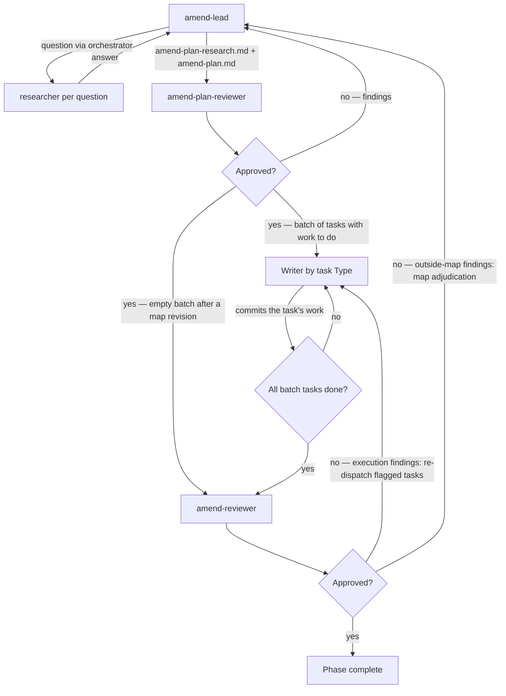

# Running the Amend Phase (Phase 1 of an amend run)

Advances an amend run from phase 0 (`intent.md`) to done, entirely on the run branch and its worktree, in two loops. First the plan loop: a lead researches the change through per-question researchers and writes the amend plan — spec and design substance plus the task list in one artifact — which a reviewer adjudicates until approved. Then execution: each task is dispatched to a fresh writer chosen by its `Type`, and a single `amend-reviewer` reviews the whole diff after each batch, running the plan's gates. On rejection, only the flagged tasks are re-dispatched; the cycle repeats until the reviewer approves.

Inputs:

- `<pipeline-family-folder>/<run>/0-intent/intent.md`

Outputs, at `<pipeline-family-folder>/<run>/1-amend/` on the run branch:

- `amend-plan-research.md` — the running record of questions, answers with sources, and the sweeps behind every closed claim.
- `amend-plan.md` — the plan: pinned target, touch map, gates, and tasks.
- `amend-plan-review-N-rejected.md` (one per rejected plan iteration) / `amend-plan-review-approved.md` (single, unnumbered file written on plan approval)
- Code and documentation changes committed on the run branch
- `amend-review-N-rejected.md` (one per rejected batch iteration) / `amend-review-approved.md` (single, unnumbered file written on approval)
- `amend-summary.md` (written by the `amend-reviewer` on approval)

## Decisions

This phase has no per-phase decisions.

## Required agents

| Agent                 | Role                                                                                                                                               |
| --------------------- | -------------------------------------------------------------------------------------------------------------------------------------------------- |
| `amend-lead`          | Drives the research through per-question researchers, deciding on the evidence. Writes `amend-plan-research.md` and `amend-plan.md`. A fresh instance adjudicates each rejection. |
| `researcher`          | One fresh instance per question. Investigates the codebase, web, and runs experiments to answer it.                                                 |
| `amend-plan-reviewer` | Adjudicates the plan against the intent and the codebase, re-executing its load-bearing checks; ejects when the run fails qualification.            |
| `build-writer-tdd`    | One fresh instance per task. Implements its assigned task with TDD, satisfies the guardrails, commits.                                              |
| `build-writer-e2e`    | One fresh instance per task. Implements the planned e2e flows, satisfies the guardrails, commits.                                                   |
| `build-writer-edit`   | One fresh instance per task. Applies its assigned no-behavior-change edit, satisfies the guardrails, commits.                                       |
| `document-writer`     | One fresh instance per task. Writes or updates its assigned documentation surfaces, satisfies the guardrails, commits.                              |
| `amend-reviewer`      | One fresh instance per batch. Reviews the run's whole diff against the plan and runs its gates.                                                     |

Serve any agent's research request: launch a fresh `researcher` per question — in parallel when the request carries several — with the question verbatim and the asking agent's identifier as its **Requester identifier**; each answers the requester directly.

## Steps

1. Launch a fresh `amend-lead`. It reads `intent.md`, drives the research, and writes `amend-plan-research.md` and `amend-plan.md`. Wait until it signals the plan is ready for review.
2. Launch a fresh `amend-plan-reviewer`. On rejection it writes `amend-plan-review-N-rejected.md` (N increments per rejection, starting at 1); on approval it writes `amend-plan-review-approved.md` (the singleton terminator).
3. On **rejected**, launch a fresh `amend-lead` with the rejection file's path; it adjudicates every finding, updates both artifacts, and reports how each was adjudicated. Launch a fresh reviewer to re-review, passing that report verbatim and the revision's commit range — until approved.
4. On **approved**, continue with task execution.
5. Determine the **initial batch**: every task in `amend-plan.md` not yet complete, in the order specified.
6. For each task in the batch, in order:
   1. Launch a fresh writer chosen by the task's `Type` — `build-writer-tdd` for a `tdd` task, `build-writer-e2e` for an `e2e` task, `build-writer-edit` for an `edit` task, `document-writer` for a `doc` task — with the verbatim task block and, on a re-dispatch after rejection, the path to the latest `amend-review-N-rejected.md` plus the issues scoped to this task.
   2. Wait for the writer to commit before launching the next task. Writers share the run worktree, so this step is strictly sequential.
7. After every writer in the batch has committed, launch a fresh `amend-reviewer` with the list of task IDs in the batch and the rejection iteration number N (starting at 1, incremented per rejection — only used if this iteration ends in rejection). The reviewer derives its own diff base — the parent of the commit that added `amend-plan.md` — so its diff spans the phase's whole work; the batch task list scopes the expected new work, not the review's boundaries. On rejection the reviewer writes `amend-review-N-rejected.md`; on approval it writes `amend-review-approved.md` and `amend-summary.md`, committed together.
8. On **rejected**: when the rejection names work outside the plan's touch map, first relaunch a fresh `amend-lead` in map adjudication — with the rejection file's path and the IDs of its outside-map issues — to extend `amend-plan.md` and its record with the sweep evidence, or eject when the map will not stay small and closed, removing the now-stale `amend-plan-review-approved.md` in its revision commit; the revised plan then re-enters the plan loop (steps 2–3: the re-review carries the lead's adjudication report and the revision's commit range) until approved. Execution findings stay with the writers. Then build the next batch: every reported or revised task whose required work is not already complete in the diff — flagged tasks needing new work, and extended or added plan entries alike. Dispatch it per step 6; when the batch is empty — the plan revision alone resolved the rejection — go directly to step 7. Increment N for the next rejection iteration.
9. On **approved**, verify the phase's completion predicate per `../pipeline-versioning.md` ("Per-phase completion").

**The eject.** At any step, the lead or a reviewer may declare the eject, and a writer may report the same discovery as a blocker (`../amend-pipeline.md`, "The eject"). Stop the run and perform the workflow's close-out; the committed artifacts remain the run's record.

