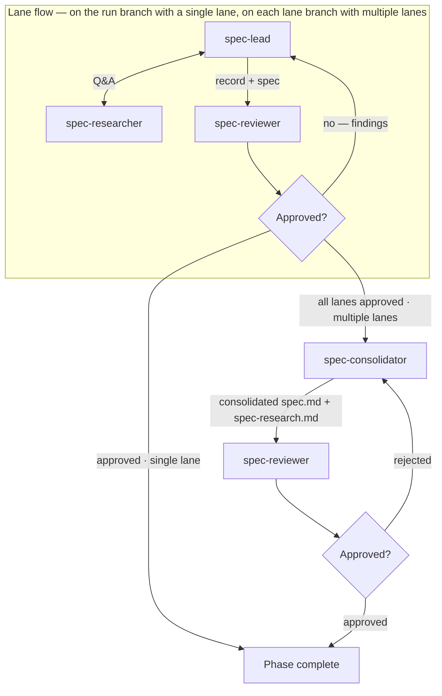

# Running the Spec Phase (Phase 1)

Turns the run's intent into an approved spec by running lanes, each a team of agents in which a lead researches, decides and records the requirements, and synthesizes the spec, and a reviewer adjudicates the requirements record against the intent and the codebase. The phase runs as isolated lanes — independent derivations of the requirements from the same intent — consolidated into one spec on the run branch. A single lane is the degenerate case: it runs on the run branch itself and consolidation is skipped.

Inputs:

- `<pipeline-family-folder>/<run>/0-intent/intent.md`

Outputs, at `<pipeline-family-folder>/<run>/1-spec/` on the run branch:

- `spec-research.md` — the requirements record; consolidated when multiple lanes run. The design-doc phase reads it.
- `spec.md` — the spec; consolidated when multiple lanes run.
- `spec-review-N-rejected.md` (one per rejected iteration)
- `spec-review-approved.md` (single, unnumbered file written on approval)

With multiple lanes, each lane's lane-approved artifacts live in its `lane-<K>` subfolder of the phase folder, and the consolidated artifacts sit at the folder root.

## Decisions

- **Lane count** — how many spec lanes to run. Default: 1.

## Required agents

| Agent               | Role                                                                                                                                                                                            | Persistent? |
| ------------------- | ------------------------------------------------------------------------------------------------------------------------------------------------------------------------------------------------ | ----------- |
| `spec-lead`      | Drives the Q&A one question at a time, deciding on the spec-researcher's evidence. Writes `spec-research.md` and synthesizes `spec.md`. Adjudicates review findings.                              | Yes         |
| `spec-researcher`   | Investigates the codebase, web, and runs experiments to answer questions.                                                                                                                          | Yes         |
| `spec-reviewer`     | Adjudicates the requirements record against the intent and the codebase (`spec.md` for fidelity), logging each check it performs; writes `spec-review-N-rejected.md` on rejection or `spec-review-approved.md` on approval. | No          |
| `spec-consolidator` | Merges the lane-approved specs and research records into the consolidated `spec.md` and `spec-research.md` on the run branch (multiple lanes only).                                                | No          |

## The lane flow

Each lane runs this flow independently, in its own worktree on its own branch:

1. Launch `spec-lead` and `spec-researcher` as persistent agents. The lead reads `intent.md`, drives an iterative Q&A with the researcher, writes the running record to `spec-research.md`, and synthesizes `spec.md`. Wait until it signals the spec is ready for review. The lead stays alive until the lane is approved.
2. Launch a fresh `spec-reviewer`. On rejection it writes `spec-review-N-rejected.md` (N increments per rejection, starting at 1); on approval it writes `spec-review-approved.md` (the singleton terminator). If it asks for research support, launch a fresh `spec-researcher` scoped to its review — never the lead's.
3. On **rejected**, relay the rejection file's path to the lead; it adjudicates every finding — adopting it, refuting it with evidence, or proposing a residual — updates both artifacts, and reports back. Launch a fresh reviewer to re-review — until approved.

## Steps

**A single lane.** Run the lane flow on the run branch, in the run branch's worktree. The lane approval is the phase approval; there is no consolidation.

**Multiple lanes:**

1. Create one lane branch and worktree per lane (branch segment `1-spec-lane-<K>`, forked from the run branch) per the **Worktree root** convention.
2. Run the lane flow in all lanes in parallel. Each lane writes its artifacts in its `lane-<K>` subfolder of the phase folder, so the lanes' paths are disjoint.
3. When every lane is approved, merge each lane branch into the run branch, remove the lane worktrees, and delete the lane branches.
4. Launch `spec-consolidator` in the run branch's worktree. It reads each lane's `spec.md` and `spec-research.md` from the `lane-<K>` subfolders, writes the consolidated `spec.md` and `spec-research.md` at the phase folder root, and commits them on the run branch.
5. Launch a fresh `spec-reviewer` against the consolidated spec on the run branch. On rejection, relaunch the `spec-consolidator` with the rejection file's path — it revises the consolidated documents — until approved.

**Completion.** Verify the phase's completion predicate per `../pipeline-versioning.md` ("Per-phase completion").

