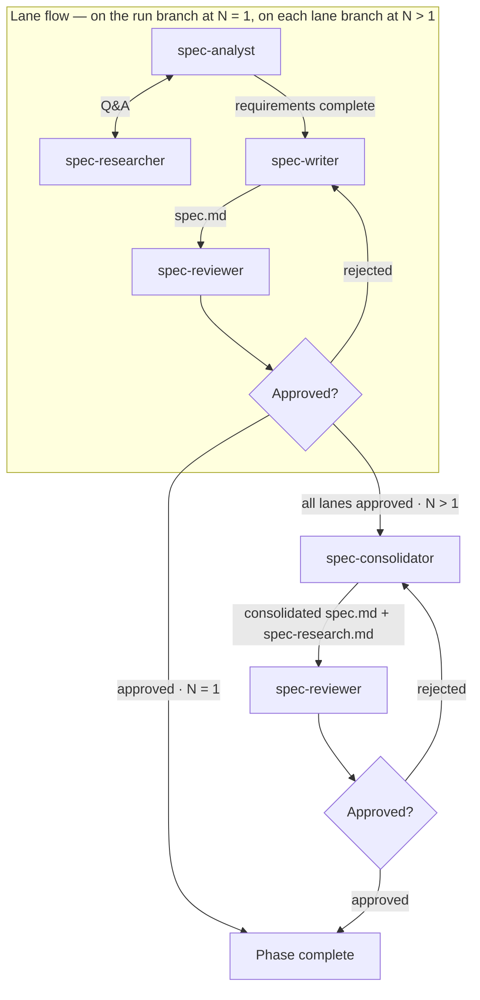

# Running the Spec Phase (Phase 1)

Turns the run's intent into an approved spec. The phase runs as N isolated lanes — independent derivations of the requirements from the same intent — consolidated into one spec on the run branch. N = 1 is the degenerate case: the lane runs on the run branch itself and consolidation is skipped.

Inputs:

- `<artifact-folder>/<run>/0-intent/intent.md`

Outputs, at `<artifact-folder>/<run>/1-spec/` on the run branch:

- `spec-research.md` — the requirements record; consolidated at N > 1. The design-doc phase reads it.
- `spec.md` — the spec; consolidated at N > 1.
- `spec-review-N-rejected.md` (one per rejected iteration)
- `spec-review-approved.md` (single, unnumbered file written on approval)

At N > 1, each lane branch holds the same paths with its lane-approved artifacts.

## Decisions

- **Lane count (N)** — how many spec lanes to run. Default: 1.

## Required agents

| Agent               | Role                                                                                                                                      | Persistent? |
| ------------------- | ----------------------------------------------------------------------------------------------------------------------------------------- | ----------- |
| `spec-analyst`      | Drives the Q&A one question at a time; writes `spec-research.md`.                                                                         | Yes         |
| `spec-researcher`   | Investigates the codebase, web, and runs experiments to answer questions.                                                                 | Yes         |
| `spec-writer`       | Writes a standalone `spec.md`.                                                                                                            | No          |
| `spec-reviewer`     | Reviews the spec adversarially; writes `spec-review-N-rejected.md` on rejection or `spec-review-approved.md` on approval.                 | No          |
| `spec-consolidator` | Merges the lane-approved specs and research records into the consolidated `spec.md` and `spec-research.md` on the run branch (N > 1 only). | No          |

## The lane flow

Each lane runs this flow independently, in its own worktree on its own branch:

1. Launch `spec-analyst` and `spec-researcher` as persistent agents. The analyst drives an iterative Q&A with the researcher and writes the running record to `spec-research.md`. Wait until the analyst signals that requirements are complete.
2. Launch a fresh `spec-writer` to write `spec.md` as a standalone document.
3. Launch a fresh `spec-reviewer`. On rejection it writes `spec-review-N-rejected.md` (the number increments per rejection, starting at 1); on approval it writes `spec-review-approved.md`.
4. On **rejected**, launch a fresh `spec-writer` with the rejection file's path; it revises `spec.md` and a fresh `spec-reviewer` re-reviews.
5. On **approved**, the branch holds a lane-approved spec.

## Steps

**N = 1.** Run the lane flow on the run branch, in the run branch's worktree. The lane review is the phase review; its approval ends the flow — continue at **Completion**.

**N > 1:**

1. Create one lane branch and worktree per lane (branch segment `1-spec-lane-<K>`, K = 1…N, forked from the run branch) per the **Worktrees** convention.
2. Run the lane flow in all lanes in parallel. Every lane writes the same canonical artifact paths on its own branch — lane identity lives only in the ref.
3. When every lane is approved, launch `spec-consolidator` in the run branch's worktree with the list of lane branches. It reads each lane's `spec.md` and `spec-research.md` (`git show <lane-ref>:<path>`), writes the consolidated `spec.md` and `spec-research.md` at the canonical paths, and commits them on the run branch.
4. Launch a fresh `spec-reviewer` against the consolidated spec on the run branch. On rejection, relaunch the `spec-consolidator` with the rejection file's path — it plays the writer role in this loop. On approval it writes `spec-review-approved.md`.
5. Remove the lane worktrees; the lane branches remain.

**Completion.** Verify the phase's completion predicate per `pipeline-versioning.md` ("Per-phase completion").

