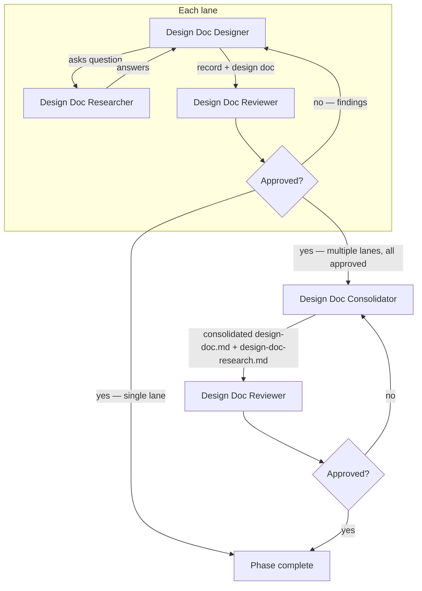

# Running the Design Doc Phase (Phase 2)

Advances the pipeline from phase 1 (spec) to phase 2 by running lanes, each a team of agents in which a designer researches, decides, records, and synthesizes the design, and a reviewer adjudicates the decision record against the spec and the codebase. With multiple lanes, a consolidator merges the lane designs on the run branch.

Inputs:

- `<pipeline-family-folder>/<run>/1-spec/spec.md`
- `<pipeline-family-folder>/<run>/1-spec/spec-research.md`

Outputs, committed on the run branch:

- `<pipeline-family-folder>/<run>/2-design-doc/design-doc-research.md`
- `<pipeline-family-folder>/<run>/2-design-doc/design-doc.md`
- `<pipeline-family-folder>/<run>/2-design-doc/design-doc-review-N-rejected.md` (one per rejected iteration, N = 1, 2, 3, …)
- `<pipeline-family-folder>/<run>/2-design-doc/design-doc-review-approved.md` (single, unnumbered file written on approval)

With multiple lanes, each lane's lane-approved artifacts live in its `lane-<K>` subfolder of the phase folder, and the consolidated artifacts sit at the folder root.

## Decisions

- **Lane count** — how many lanes design independently. Default: 1.
- **Lane mode** — `isolated` or `divergent`; meaningful only with multiple lanes. Default: isolated.

When asking the owner for the lane mode, explain the difference: both modes repeat the phase once per lane, and differ in what the repetition is for.

- **Isolated** produces the same design several times to make it trustworthy. Lanes run in parallel, blind to one another, and independently converge: where they agree the design is confirmed, and what one lane caught the others missed completes it. Choose it when one good design likely exists and you want reliability and completeness. Blind repetition converges on the obvious design — it cannot produce alternatives.
- **Divergent** produces several different designs to choose from. Lanes run in sequence, each reading the previous designs and required to differ materially; the consolidator judges the alternatives, keeps the strongest, and records the rejected ones. Choose it when several architectures could win, or when the obvious design may be a local optimum. It costs sequential time, and in a narrow design space it forces strained alternatives.

## Required agents

| Agent                     | Role                                                                                                                                                                                          | Persistent? |
| ------------------------- | --------------------------------------------------------------------------------------------------------------------------------------------------------------------------------------------- | ----------- |
| `design-doc-designer`     | Drives the design Q&A one topic at a time, deciding on the design-doc-researcher's evidence. Writes `design-doc-research.md` — every load-bearing claim carrying its check — and synthesizes `design-doc.md`. Adjudicates review findings. | Yes         |
| `design-doc-researcher`   | Investigates the codebase, web, and runs experiments to answer questions.                                                                                                                       | Yes         |
| `design-doc-reviewer`     | Adjudicates the decision record against the spec and the codebase (`design-doc.md` for fidelity), logging each check it performs; writes `design-doc-review-N-rejected.md` on rejection or `design-doc-review-approved.md` on approval. | No          |
| `design-doc-consolidator` | Merges the lane-approved designs and research records into the consolidated `design-doc.md` and `design-doc-research.md` on the run branch (multiple lanes only).                               | No          |

## The lane flow

Each lane runs the full flow in its assigned worktree:

1. Launch `design-doc-designer` and `design-doc-researcher` as persistent agents. The designer reads `spec.md` and `spec-research.md`, drives an iterative Q&A with the researcher, writes the running record to `design-doc-research.md`, and synthesizes `design-doc.md`. Wait until it signals the design is ready for review. The designer stays alive until the lane is approved.
2. Launch a fresh `design-doc-reviewer`. On rejection it writes `design-doc-review-N-rejected.md` (N increments per rejection, starting at 1); on approval it writes `design-doc-review-approved.md` (the singleton terminator).
3. On **rejected**, relay the rejection file's path to the designer; it adjudicates every finding — adopting it, refuting it with evidence, or recording an accepted residual — updates both artifacts, and reports back. Launch a fresh reviewer to re-review — until approved.

## Steps

**A single lane** — run the lane flow on the run branch, in the run branch's worktree. The lane approval is the phase approval; there is no consolidation.

**Multiple lanes:**

1. Run the lane flow in every lane; each lane writes its artifacts in its `lane-<K>` subfolder of the phase folder, so the lanes' paths are disjoint:
   - **Isolated mode** — create one lane branch and worktree per lane, forked from the run branch (branch segment `2-design-doc-lane-<K>`), and run all lanes in parallel, mutually blind. When every lane is approved, merge each lane branch into the run branch, remove the lane worktrees, and delete the lane branches.
   - **Divergent mode** — run the lanes sequentially in the run branch's worktree, committing on the run branch.
2. Launch `design-doc-consolidator` in the run branch's worktree. It reads each lane's `design-doc.md` and `design-doc-research.md` from the `lane-<K>` subfolders and commits the consolidated `design-doc.md` and `design-doc-research.md` at the phase folder root on the run branch.
3. Launch a fresh `design-doc-reviewer` to review the consolidated design. On **rejected**, relaunch the `design-doc-consolidator` with the rejection file's path — it revises the consolidated documents — until approved.

On **approved**, verify the phase 2 completion predicate per `../pipeline-versioning.md` ("Per-phase completion").

