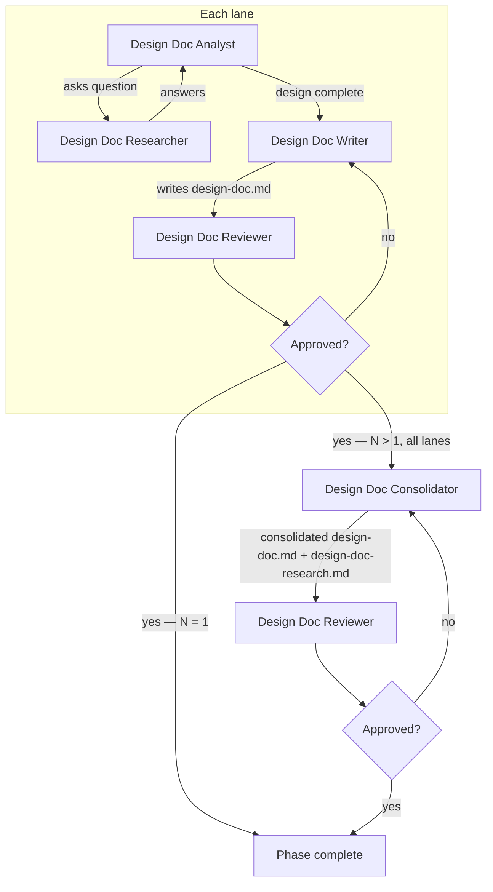

# Running the Design Doc Phase (Phase 2)

Advances the pipeline from phase 1 (spec) to phase 2 by running N lanes, each a team of agents that drives iterative design Q&A, synthesizes a standalone design doc, and reviews it adversarially. When N > 1, a consolidator merges the lane designs on the run branch.

Inputs:

- `<artifact-folder>/<run>/1-spec/spec.md`
- `<artifact-folder>/<run>/1-spec/spec-research.md`

Outputs, committed on the run branch:

- `<artifact-folder>/<run>/2-design-doc/design-doc-research.md`
- `<artifact-folder>/<run>/2-design-doc/design-doc.md`
- `<artifact-folder>/<run>/2-design-doc/design-doc-review-N-rejected.md` (one per rejected iteration, N = 1, 2, 3, …)
- `<artifact-folder>/<run>/2-design-doc/design-doc-review-approved.md` (single, unnumbered file written on approval)

When N > 1, each lane branch carries its lane-approved versions of the same paths.

## Decisions

- **Lane count (N)** — how many lanes design independently. Default: 1.
- **Lane mode** — `isolated` or `divergent`; meaningful only when N > 1. Default: isolated.

## Required agents

| Agent                     | Role                                                                                                                                                     | Persistent? |
| ------------------------- | -------------------------------------------------------------------------------------------------------------------------------------------------------- | ----------- |
| `design-doc-analyst`      | Drives the design Q&A one topic at a time, deciding the design on the design-doc-researcher's evidence. Writes `design-doc-research.md`.                 | Yes         |
| `design-doc-researcher`   | Investigates the codebase, web, and runs experiments to answer questions.                                                                                 | Yes         |
| `design-doc-writer`       | Writes a standalone `design-doc.md` from `spec.md` and `design-doc-research.md`.                                                                          | No          |
| `design-doc-reviewer`     | Reviews a design adversarially; writes `design-doc-review-N-rejected.md` on rejection or `design-doc-review-approved.md` on approval.                     | No          |
| `design-doc-consolidator` | Merges the lane-approved designs and research records into the consolidated `design-doc.md` and `design-doc-research.md` on the run branch (N > 1 only). | No          |

## The lane flow

Each lane runs the full flow in its assigned worktree:

1. Launch `design-doc-analyst` and `design-doc-researcher` as persistent agents (per the **Team spawning** convention). The analyst reads `spec.md` and `spec-research.md`, drives an iterative Q&A with the researcher, and writes the running record to `design-doc-research.md`. Wait until it signals that the design is complete.
2. Launch a fresh `design-doc-writer` to synthesize `design-doc.md` as a standalone document.
3. Launch a fresh `design-doc-reviewer`. On rejection it writes `design-doc-review-N-rejected.md` (N increments per rejection, starting at 1); on approval it writes `design-doc-review-approved.md` (the singleton terminator).
4. On **rejected**, launch a fresh `design-doc-writer` with the rejection file's path; it revises `design-doc.md` and the reviewer re-reviews — until approved.

## Steps

**N = 1** — run the lane flow on the run branch, in the run branch's worktree. The lane approval is the phase approval; there is no consolidation.

**N > 1:**

1. Create one lane branch and worktree per lane, forked from the run branch (branch segment `2-design-doc-lane-<K>`).
2. Run the lane flow in every lane:
   - **Isolated mode** — all lanes in parallel, mutually blind.
   - **Divergent mode** — lanes run sequentially. Lane K's analyst launch prompt includes the lane branch refs of the previously approved lanes' `design-doc.md` files (readable with `git show <lane-ref>:<path>`) and the instruction that its design must materially differ from every previous lane's. Everything else is identical to isolated mode.
3. When every lane's design is lane-approved, launch `design-doc-consolidator` in the run branch's worktree, its prompt naming the lane branch refs and the lane mode. It reads each lane's `design-doc.md` and `design-doc-research.md` off the lane branches and commits the consolidated `design-doc.md` and `design-doc-research.md` in the phase folder on the run branch.
4. Remove the lane worktrees.
5. Launch a fresh `design-doc-reviewer` to review the consolidated design. On **rejected**, relaunch the `design-doc-consolidator` with the rejection file's path — it plays the writer role in this loop — until approved.

On **approved**, verify the phase 2 completion predicate per `pipeline-versioning.md` ("Per-phase completion").

