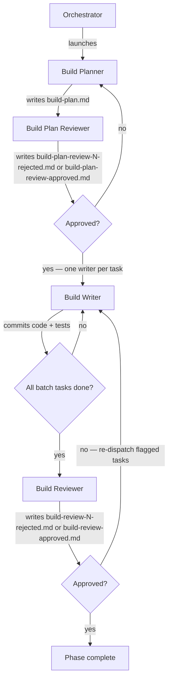

# Running the Build Phase (Phase 3)

Advances the run from phase 2 (design doc) to phase 3, entirely on the run branch and its worktree. A planner/reviewer pair iterates until the plan is approved, then each task is dispatched to a fresh writer chosen by its `Type`, and a single `build-reviewer` reviews the result after each batch. On rejection, only the flagged tasks are re-dispatched; the cycle repeats until the reviewer approves.

Inputs:

- `<pipeline-family-folder>/<run>/1-spec/spec.md`
- `<pipeline-family-folder>/<run>/2-design-doc/design-doc.md`

Outputs:

- `<pipeline-family-folder>/<run>/3-build/build-plan.md`
- `<pipeline-family-folder>/<run>/3-build/build-plan-review-N-rejected.md` (one per rejected plan iteration, N = 1, 2, 3, …)
- `<pipeline-family-folder>/<run>/3-build/build-plan-review-approved.md` (single, unnumbered file written on plan approval)
- Code changes, unit tests, and end-to-end tests committed on the run branch
- `<pipeline-family-folder>/<run>/3-build/build-review-N-rejected.md` (one per rejected batch iteration, N = 1, 2, 3, …)
- `<pipeline-family-folder>/<run>/3-build/build-review-approved.md` (single, unnumbered file written on approval)
- `<pipeline-family-folder>/<run>/3-build/build-summary.md` (written by the `build-reviewer` on approval)

## Decisions

This phase has no per-phase decisions.

## Required agents

| Agent                 | Role                                                                                                                                        | Persistent? |
| --------------------- | ------------------------------------------------------------------------------------------------------------------------------------------- | ----------- |
| `build-planner`   | Writes `build-plan.md`.                                                                                                                      | No          |
| `build-plan-reviewer` | Reviews the build plan adversarially.                                                                                                        | No          |
| `build-writer-tdd`    | One fresh instance per task. Implements its assigned task with TDD, satisfies the guardrails, commits.                                       | No          |
| `build-writer-e2e`    | One fresh instance per task. Implements the planned e2e flows, satisfies the guardrails, commits.                                            | No          |
| `build-reviewer`      | One fresh instance per batch. Reviews the run's diff against the plan, spec, and design.                                                     | No          |

## Steps

1. Launch a fresh `build-planner` to write `build-plan.md`.
2. Launch a fresh `build-plan-reviewer`. On rejection it writes `build-plan-review-N-rejected.md` (N increments per rejection, starting at 1); on approval it writes `build-plan-review-approved.md` (no number — the singleton terminator).
3. On **rejected**, launch a fresh `build-planner` with the rejection file's path. It revises `build-plan.md`. A fresh `build-plan-reviewer` re-reviews.
4. On **approved**, continue with task execution.
5. If your runtime exposes a task-list tool, use it: one entry per task from `build-plan.md`, tracking dispatch status (pending / in progress / done) throughout the phase, including re-dispatches. The list is display only — the commits and the diff are the only record of task progress.
6. Determine the **initial batch**: every task in `build-plan.md` not yet complete (every task on a fresh phase start), in the order specified.
7. For each task in the batch, in order:
   1. Launch a fresh writer chosen by the task's `Type` — `build-writer-tdd` for a `tdd` task, `build-writer-e2e` for an `e2e` task — with the verbatim task block (Goal / Type / Files to change / Changes / Depends on / Traces to / Acceptance) and, on a re-dispatch after rejection, the path to the latest `build-review-N-rejected.md` plus the issues scoped to this task.
   2. Wait for the writer to commit before launching the next task. Writers share the run worktree, so this step is strictly sequential.
8. After every writer in the batch has committed, launch a fresh `build-reviewer` with the list of task IDs in the batch and the rejection iteration number N (starting at 1, incremented per rejection — only used if this iteration ends in rejection). The reviewer derives its own diff base — the parent of the commit that added `build-plan.md` — so its diff spans the phase's whole work; the batch task list scopes the expected new work, not the review's boundaries — the reviewer may attribute an issue to any task in `build-plan.md`, and earlier batches' work in the diff is expected there. On rejection the reviewer writes `build-review-N-rejected.md`; on approval it writes `build-review-approved.md` (no number — the singleton terminator) and `build-summary.md`, committed together.
9. On **rejected**, build the next batch from the deduplicated list of task IDs the reviewer reported. Go to step 7, with N incremented for the next rejection iteration.
10. On **approved**, verify the phase 3 completion predicate per `../pipeline-versioning.md` ("Per-phase completion").

