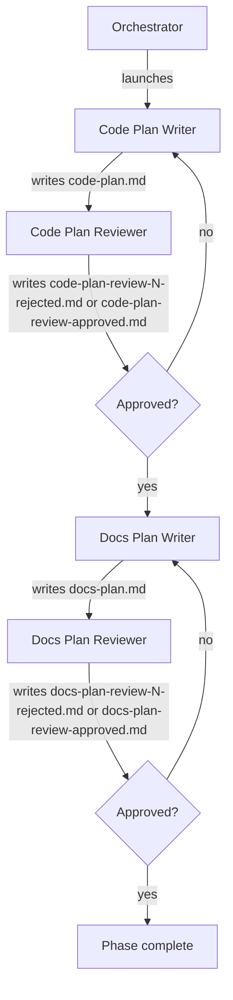

# Running the Plan Phase (Phase 3)

Advances the pipeline from phase 2 (design doc) to phase 3 by spawning two writer/reviewer pairs in sequence: first a code-plan pair that produces `code-plan.md`, then a docs-plan pair that produces `docs-plan.md`. Each pair iterates until its plan is approved.

Inputs:

- `<artifacts-folder>/1-spec/spec.md`
- `<artifacts-folder>/2-design-doc/design-doc.md`

Outputs:

- `<artifacts-folder>/3-plan/code-plan.md`
- `<artifacts-folder>/3-plan/code-plan-review-N-rejected.md` (one per rejected code-plan iteration, N = 1, 2, 3, …)
- `<artifacts-folder>/3-plan/code-plan-review-approved.md` (single, unnumbered file written on code-plan approval)
- `<artifacts-folder>/3-plan/docs-plan.md`
- `<artifacts-folder>/3-plan/docs-plan-review-N-rejected.md` (one per rejected docs-plan iteration, N = 1, 2, 3, …)
- `<artifacts-folder>/3-plan/docs-plan-review-approved.md` (single, unnumbered file written on docs-plan approval)

## Decisions

This phase has no per-phase decisions.

## Required agents

| Agent                | Role                                                                                                       | Persistent? |
| -------------------- | ---------------------------------------------------------------------------------------------------------- | ----------- |
| `code-plan-writer`   | Writes `code-plan.md`.                                                                                     | No          |
| `code-plan-reviewer` | Reviews the code plan adversarially; writes `code-plan-review-N-rejected.md` on rejection or `code-plan-review-approved.md` on approval.                     | No          |
| `docs-plan-writer`    | Writes `docs-plan.md`, focused on what/where/who.                                                           | No          |
| `docs-plan-reviewer`  | Reviews the docs plan adversarially; writes `docs-plan-review-N-rejected.md` on rejection or `docs-plan-review-approved.md` on approval.                       | No          |

## Steps

1. Launch a fresh `code-plan-writer` to write `code-plan.md`.
2. Launch a fresh `code-plan-reviewer`. On rejection it writes `code-plan-review-N-rejected.md` (N increments per rejection, starting at 1); on approval it writes `code-plan-review-approved.md` (no number — the singleton terminator).
3. On **rejected**, launch a fresh `code-plan-writer` with the rejection file's path. It revises `code-plan.md`. The `code-plan-reviewer` re-reviews.
4. On **approved**, launch a fresh `docs-plan-writer` to write `docs-plan.md`.
5. Launch a fresh `docs-plan-reviewer`. On rejection it writes `docs-plan-review-N-rejected.md` (N increments per rejection, starting at 1); on approval it writes `docs-plan-review-approved.md` (no number — the singleton terminator).
6. On **rejected**, launch a fresh `docs-plan-writer` with the rejection file's path. It revises `docs-plan.md`. The `docs-plan-reviewer` re-reviews.
7. On **approved**, verify the phase 3 completion predicate per `pipeline-versioning.md` ("Per-phase completion"): `code-plan.md`, `code-plan-review-approved.md`, `docs-plan.md`, `docs-plan-review-approved.md`, and every `*-rejected.md` review file are committed on the pipeline branch.

