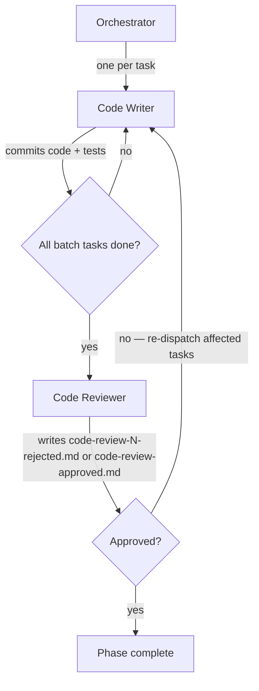

# Running the Code Phase (Phase 4)

Advances the pipeline from phase 3 (plan) to phase 4 by dispatching each code task to a fresh writer chosen by the task's `Type` — `code-writer-tdd` for tdd tasks, `code-writer-e2e` for e2e tasks — then reviewing the full batch with a single `code-reviewer`. On rejection, only the tasks the reviewer flagged are re-dispatched; the cycle repeats until the reviewer approves.

Inputs:

- `<artifacts-folder>/1-spec/spec.md`
- `<artifacts-folder>/2-design-doc/design-doc.md`
- `<artifacts-folder>/3-plan/code-plan.md`

Outputs:

- Code changes, unit tests, and end-to-end tests committed on the pipeline branch.
- `<artifacts-folder>/4-code/code-review-N-rejected.md` (one per rejected iteration, N = 1, 2, 3, …).
- `<artifacts-folder>/4-code/code-review-approved.md` (single, unnumbered file written on approval).
- `<artifacts-folder>/4-code/code-summary.md` (written by the `code-reviewer` on approval, one per run).

## Decisions

This phase has no per-phase decisions.

## Required agents

| Agent             | Role                                                                                         | Persistent? |
| ----------------- | -------------------------------------------------------------------------------------------- | ----------- |
| `code-writer-tdd` | One fresh instance per task. Implements its assigned task with TDD, runs the gates, commits. | No          |
| `code-writer-e2e` | One fresh instance per task. Implements the planned e2e flows, runs the gates, commits.      | No          |
| `code-reviewer`   | One fresh instance per batch. Reviews the full batch.                                        | No          |

## Steps

1. If your runtime exposes a task-list tool, you must use it. Create one entry per task from `code-plan.md` and use the list to track dispatch status (pending / in progress / done) throughout the phase, including re-dispatches.
2. Determine the **initial batch**: every task in `code-plan.md`, in the order specified.
3. For each task in the batch, in order:
   1. Launch a fresh writer chosen by the task's `Type` — `code-writer-tdd` for a `tdd` task, `code-writer-e2e` for an `e2e` task — with the verbatim task block (Goal / Files / Changes / Type / Depends on / Traces to / Acceptance) and, if this is a re-dispatch on rejection, the path to the latest `code-review-N-rejected.md` plus the issues scoped to this task.
   2. Wait for the code-writer to commit before launching the next task. Code-writers share the pipeline branch's single working tree, so this step is strictly sequential.
4. After every code-writer in the batch has committed, launch a fresh `code-reviewer` with the list of task IDs in the batch, the base ref to diff against (the start of the current run — see the **Revision base ref** rule in `pipeline-versioning.md`), the rejection iteration number N (starting at 1, incremented per rejection — only used if this iteration ends in rejection), and the resolved content of `summary-format.md`. On rejection the reviewer writes `code-review-N-rejected.md`; on approval it writes `code-review-approved.md` (no number — the singleton terminator).
5. On **rejected**, build the next batch from the deduplicated list of task IDs the reviewer reported. Go to step 3, with N incremented for the next rejection iteration.
6. On **approved**, verify the phase 4 completion predicate per `pipeline-versioning.md` ("Per-phase completion"): all code changes, unit tests, end-to-end tests, every `code-review-N-rejected.md`, `code-review-approved.md`, and `4-code/code-summary.md` are committed on the pipeline branch.

