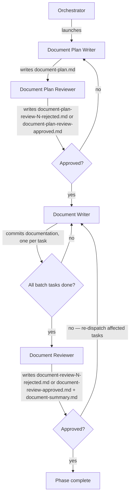

# Running the Document Phase (Phase 4)

Advances the run from phase 3 (build) to phase 4, entirely on the run branch. A plan writer/reviewer pair first produces the approved `document-plan.md`, planned against the code the build phase shipped. Each plan task then goes to a fresh `document-writer`, and a single `document-reviewer` reviews the full batch. On rejection, only the tasks the reviewer flagged are re-dispatched; the cycle repeats until the reviewer approves.

Inputs:

- `<pipeline-family-folder>/<run>/1-spec/spec.md`
- `<pipeline-family-folder>/<run>/2-design-doc/design-doc.md`
- `<pipeline-family-folder>/<run>/3-build/build-summary.md`
- The code, tests, and inline API documentation shipped by the build phase.

Outputs:

- `<pipeline-family-folder>/<run>/4-document/document-plan.md`
- `<pipeline-family-folder>/<run>/4-document/document-plan-review-N-rejected.md` (one per rejected iteration, N = 1, 2, 3, …)
- `<pipeline-family-folder>/<run>/4-document/document-plan-review-approved.md` (single, unnumbered file written on approval)
- Documentation updates (READMEs, guides, examples, configuration descriptions, changelogs, contributor docs, internal conventions, non-symbol inline narrative) committed on the run branch.
- `<pipeline-family-folder>/<run>/4-document/document-review-N-rejected.md` (one per rejected iteration, N = 1, 2, 3, …)
- `<pipeline-family-folder>/<run>/4-document/document-review-approved.md` (single, unnumbered file written on approval)
- `<pipeline-family-folder>/<run>/4-document/document-summary.md` (written by the `document-reviewer` on approval, committed together with the approval file)

## Decisions

This phase has no per-phase decisions.

## Required agents

| Agent                    | Role                                                                                                           | Persistent? |
| ------------------------ | --------------------------------------------------------------------------------------------------------------- | ----------- |
| `document-plan-writer`   | Writes `document-plan.md` against the shipped code, focused on what/where/for whom.                              | No          |
| `document-plan-reviewer` | Reviews the plan adversarially; validates the guardrail scopes.                                                  | No          |
| `document-writer`        | One fresh instance per task. Writes or updates the documentation; verifies accuracy; runs the gates; commits.   | No          |
| `document-reviewer`      | One fresh instance per batch. Reviews the full batch; writes the summary on approval.                            | No          |

## Steps

1. Launch a fresh `document-plan-writer` to write `document-plan.md`.
2. Launch a fresh `document-plan-reviewer`. On rejection it writes `document-plan-review-N-rejected.md` (N increments per rejection, starting at 1); on approval it writes `document-plan-review-approved.md` (no number — the singleton terminator).
3. On **rejected**, launch a fresh `document-plan-writer` with the rejection file's path. It revises `document-plan.md`. A fresh `document-plan-reviewer` re-reviews.
4. On **approved**, continue with task execution.
5. If your runtime exposes a task-list tool, use it: one entry per task from `document-plan.md`, tracking dispatch status (pending / in progress / done) throughout the phase, including re-dispatches. The list is display only — the commits and the diff are the only record of task progress.
6. Determine the **initial batch**: every task in `document-plan.md` not yet complete (every task on a fresh phase start), in the order specified.
7. For each task in the batch, in order:
   1. Launch a fresh `document-writer` with the verbatim task block (Goal / Audience / Files to change / Sections / scope / Depends on / Traces to / Acceptance) and, on a re-dispatch after rejection, the path to the latest `document-review-N-rejected.md` plus the issues attached to this task.
   2. Wait for it to commit before launching the next task. Document-writers share the run worktree, so this step is strictly sequential.
8. After every document-writer in the batch has committed, launch a fresh `document-reviewer` with the list of task IDs in the batch and the rejection iteration number N (starting at 1, incremented per rejection — only used if this iteration ends in rejection). The reviewer derives its own diff base — the parent of the commit that added `document-plan.md` — so its diff spans the phase's whole work; the batch task list scopes the expected new work, not the review's boundaries — the reviewer may attribute an issue to any task in `document-plan.md`, and earlier batches' work in the diff is expected there. On rejection the reviewer writes `document-review-N-rejected.md`; on approval it writes `document-review-approved.md` (no number — the singleton terminator) and `document-summary.md`, committed together.
9. On **rejected**, build the next batch from the deduplicated list of task IDs the reviewer reported. Go to step 7, with N incremented for the next rejection iteration.
10. On **approved**, verify the phase 4 completion predicate per `../pipeline-versioning.md` ("Per-phase completion").

