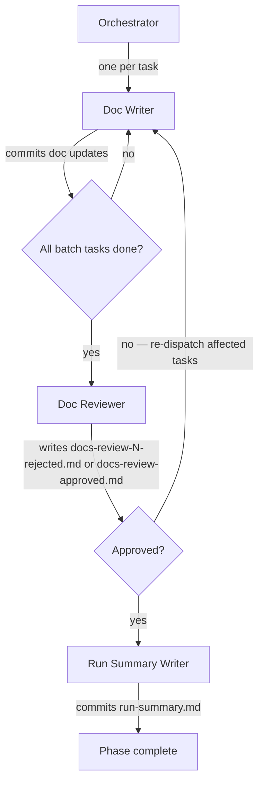

# Running the Docs Phase (Phase 5)

Advances the pipeline from phase 4 (code) to phase 5 by dispatching the documentation tasks to a fresh `doc-writer` per task, then reviewing the full batch with a single `doc-reviewer`. On rejection, only the tasks the reviewer flagged are re-dispatched; the cycle repeats until the reviewer approves.

Inputs:

- `<artifacts-folder>/1-spec/spec.md`
- `<artifacts-folder>/2-design-doc/design-doc.md`
- `<artifacts-folder>/3-plan/doc-plan.md`
- The code, tests, and inline API documentation shipped in phase 4.

Outputs:

- Documentation updates (READMEs, guides, examples, configuration descriptions, changelogs, contributor docs, internal conventions, non-symbol inline narrative) committed on the pipeline branch.
- `<artifacts-folder>/5-docs/docs-review-N-rejected.md` (one per rejected iteration, N = 1, 2, 3, …).
- `<artifacts-folder>/5-docs/docs-review-approved.md` (single, unnumbered file written on approval).
- `<artifacts-folder>/run-summary.md` (at the run-folder root, not under `5-docs/`).

## Decisions

This phase has no per-phase decisions.

## Required agents

| Agent                 | Role                                                                                  | Persistent? |
| --------------------- | ------------------------------------------------------------------------------------- | ----------- |
| `doc-writer`          | One fresh instance per task. Writes or updates the documentation; validates; commits. | No          |
| `doc-reviewer`        | One fresh instance per batch. Reviews the full batch.                                 | No          |
| `run-summary-writer`  | One fresh instance per run. Writes the run summary after docs approval.               | No          |

## Steps

1. If your runtime exposes a task-list tool, you must use it. Create one entry per task from `doc-plan.md` and use the list to track dispatch status (pending / in progress / done) throughout the phase, including re-dispatches.
2. Determine the **initial batch**: every task in `doc-plan.md`, in the order specified.
3. For each task in the batch, in order:
   1. Launch a fresh `doc-writer` with the verbatim task block (Goal / Audience / Files / Sections-scope / Depends on / Traces to / Acceptance) and, if this is a re-dispatch on rejection, the path to the latest `docs-review-N-rejected.md` plus the issues scoped to this task.
   2. Wait for the doc-writer to commit before launching the next task. Doc-writers share the pipeline branch's single working tree, so this step is strictly sequential.
4. After every doc-writer in the batch has committed, launch a fresh `doc-reviewer` with the list of task IDs in the batch, the base ref to diff against (the start of the current run — see the **Reviewer base ref** rule in `pipeline-versioning.md`), and the rejection iteration number N (starting at 1, incremented per rejection — only used if this iteration ends in rejection). On rejection the reviewer writes `docs-review-N-rejected.md`; on approval it writes `docs-review-approved.md` (no number — the singleton terminator).
5. On **rejected**, build the next batch from the deduplicated list of task IDs the reviewer reported. Go to step 3, with N incremented for the next rejection iteration.
6. On **approved**, launch a fresh `run-summary-writer` with the resolved summary format (project override else the skill default `reference/run-summary-format.md`) as an extra input. The writer reads the run's committed artifacts and the shipped code/docs as files and commits `run-summary.md` at the run-folder root.
7. Verify the phase 5 completion predicate per `pipeline-versioning.md` ("Per-phase completion"): all documentation changes, every `docs-review-N-rejected.md`, `docs-review-approved.md`, and `run-summary.md` are committed on the pipeline branch.

